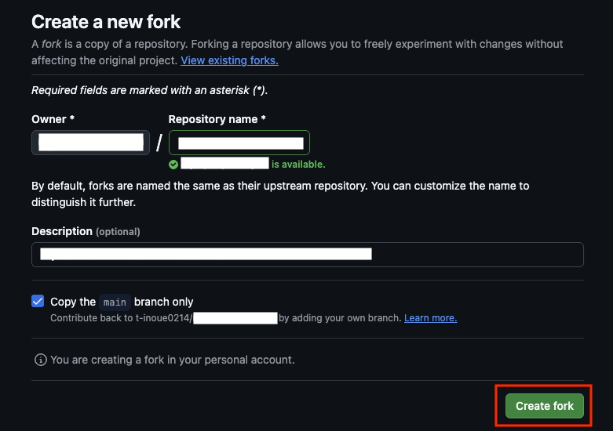
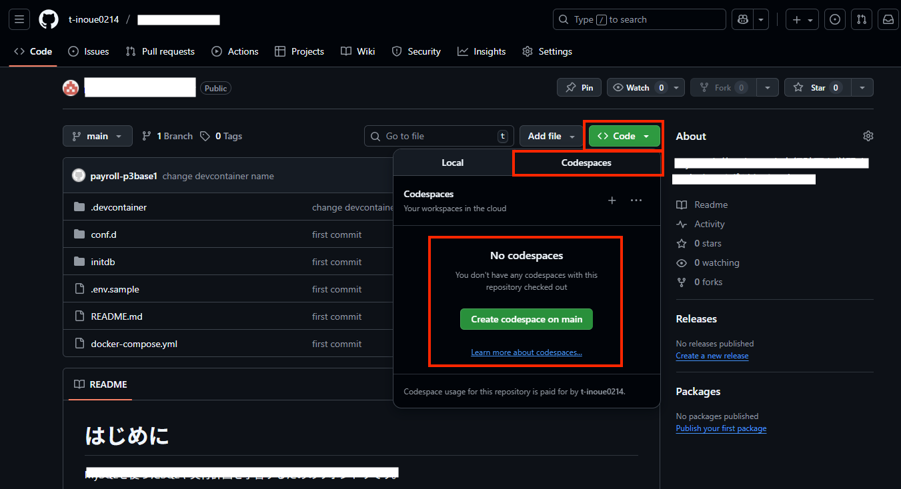
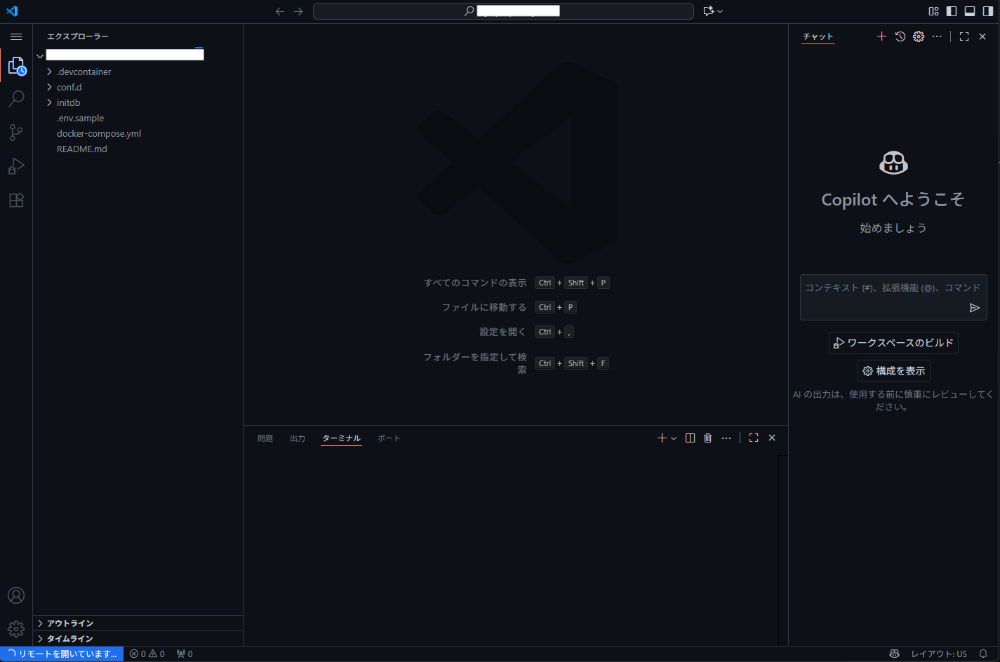

# starter-java-first-steps

環境構築不要！ブラウザだけで学べるJavaプログラミング超入門講座へようこそ。

このリポジトリは、**GitHub Codespaces** を使って、どのプログラミング言語も使ったことがない人でもプログラミング言語の学習をスタートできるようにしたいと思い作っています。

超入門レベルであれば、どのプログラミング言語でも良いのですが、仕事では多くの現場がJava言語です。そのため、ここではJava言語を使って簡単なプログラミングの経験を積み、より高度な学習にすすめることを目指します。

> **⚠️ 学習上の重要ルール**
> [Oracle公式ドキュメント(dev.java)](https://dev.java/learn/) の情報が「最新かつ正確」な一次情報です。
> ここで記載した内容や、もし AI から回答を得た場合であっても、**必ず [Oracle公式ドキュメント(dev.java)](https://dev.java/learn/) の記載を確認しながら実装する癖** をつけてください。

---

## 💻 1. 開発環境 (Development Environment)

この勉強会では **GitHub Codespaces** を使用します。

面倒な環境構築は不要です。ブラウザさえあれば、すぐに学習を始められます。

1. **GitHubにログイン** してください（アカウントがない場合は作成してください）。

1. このリポジトリをフォークするため、右上の`fork`をクリックする。

    

1. `Create fork`ボタンをクリックして、フォーク（自分のアカウントにコピーして新しいリポジトリを作成）する。

    

1. `Codespace`を起動するため、`Code`タブに移動し、右上にある緑色の`code`のプルダウンメニューを開き、`Codespace`タブを開き、`Create codespace on main`をクリックする。

    

1. `Codespace`の生成にはしばらく時間がかかるため、しばらく待つ。

    

1. `VSCode`が起動するが、画面左下が`リモートを開いています...`の間は待つ。

    

1. 画面左下が`Codespace`になった場合は、`Codespace`が起動完了しました

    

環境が立ち上がったら、左側のファイル一覧から学習したい章のフォルダを開いてください。

### Codespaces利用上の注意

- `Github`の`Codespaces`を利用する。`Codespaces`は設定によってはコストがかかるため、[Codespace の利用上の注意](./CODE_SPACES_SERICE.md) はよく確認すること。
- コストをかけないためにも、セキュリティの意味でも、使い終わったら [停止方法](./CODE_SPACES_SERICE.md#3-停止方法) に従って停止することを推奨する。

---

## 2. 学習の始め方

1. Codespaces を起動
    - 

1. **環境の準備を待つ**
    - ブラウザでVS Codeが起動する。
    - 初回はJavaのセットアップや日本語化のために1〜2分ほどかかる。
    - 左下のステータスバーなどが落ち着くまで少し待つ。

1. **学習スタート！**
    - 左側のファイル一覧から `src/main/java/com/example/introduction` フォルダを開く。
    - `README.md` をクリックして開き、解説を読みながら進める。
    - `README.md` を右クリックして「プレビューを開く (Open Preview)」を選ぶと読みやすくなる。

---

## 📚 3. この講座で学ぶこと

Javaの「書き方」だけでなく、「なぜそう書くのか？」という仕組みや、プログラミングの楽しさを重視しています。

新卒プログラマが中級プログラマへステップアップするための全15章構成です。

### 超入門編（第01〜05章）

| 章 | タイトル | 学ぶ内容 |
| :--- | :--- | :--- |
| **01** | **[Javaに触れてみよう](./src/main/java/com/example/introduction/README.md)** | Hello World, JShell, 実行方法 |
| **02** | **[データと型](./src/main/java/com/example/variables_and_types/README.md)** | 変数, プリミティブ型, キャストの罠 |
| **03** | **[プログラムの流れを作る](./src/main/java/com/example/control_flow/README.md)** | if文, for文, 配列, FizzBuzz |
| **04** | **[クラスとオブジェクト](./src/main/java/com/example/class_and_objects/README.md)** | クラス設計, フィールド, メソッド, new |
| **05** | **[便利な道具箱とミニゲーム](./src/main/java/com/example/practical_java/README.md)** | List, Map, Scanner, 数当てゲーム作成 |

### 基礎応用編（第06〜09章）

> 基本文法は理解できた方が対象です。「なぜこの書き方をするのか」という現場視点を身につけます。

| 章 | タイトル | 学ぶ内容 |
| :--- | :--- | :--- |
| **06** | **[OOP・型システム](./src/main/java/com/example/oop_and_type_system/README.md)** | ラムダ式, 関数型インターフェース, Enum, アノテーション, リフレクション |
| **07** | **[データ構造を使いこなす](./src/main/java/com/example/collections_deep/README.md)** | 配列の限界, Comparator, HashMap vs TreeMap vs LinkedHashMap, LRUキャッシュ自作 |
| **08** | **[モダンAPIと堅牢なコーディング](./src/main/java/com/example/modern_api/README.md)** | Stream API, Optional, java.time, 例外処理の深掘り, try-with-resources |
| **09** | **[アルゴリズムとソート](./src/main/java/com/example/algorithms/README.md)** | O記法, バブル/マージ/クイックソート, 二分探索, Arrays.sort()との比較 |

### 実践編（第10〜13章）

> 外部リソース（ファイル・DB・スレッド・HTTP）を扱います。現場で必ず直面する課題を体験します。

| 章 | タイトル | 学ぶ内容 |
| :--- | :--- | :--- |
| **10** | **[I/OとWebの基礎](./src/main/java/com/example/io_and_network/README.md)** | CSV/JSON/XML読み書き, HTTPサーバースクラッチ開発, リファクタリング体験 |
| **11** | **[データベースアクセス（JDBC）](./src/main/java/com/example/database_jdbc/README.md)** | JDBC, CRUD操作, SQLインジェクション防止 |
| **12** | **[並行処理・非同期処理の基礎](./src/main/java/com/example/concurrency/README.md)** | Thread, 競合状態, デッドロック, synchronized, Future, CompletableFuture |
| **13** | **[HTTPクライアントと外部API連携](./src/main/java/com/example/http_client/README.md)** | HttpClient, GET/POST, コネクションプール, KeepAlive, キャッシュ, 速度改善 |

### 設計編（第14〜15章）

> 全章の知識を統合します。「なぜその設計にするのか」を徹底的に問います。

| 章 | タイトル | 学ぶ内容 |
| :--- | :--- | :--- |
| **14** | **[設計とアーキテクチャ](./src/main/java/com/example/architecture/README.md)** | アーキテクチャ進化史（Layered/Hexagonal/Onion/Clean）, Big Ball of Mud, Onion Architecture 実装, DIP, DI |
| **15** | **[クリーンアーキテクチャ](./src/main/java/com/example/clean_architecture/README.md)** | Clean Architecture, Input Port, Output Boundary, Push型データフロー |

---

## 💻 4. 開発環境について

この講座は以下の環境で動作するように設定されています（自動構築されます）。

- **OS:** Linux (Debian)
- **Java:** OpenJDK 21
- **Editor:** VS Code Web (日本語化済み)
- **Extensions:**
  - Extension Pack for Java
  - Japanese Language Pack

---

## 📝 重視する思想

このリポジトリでは、「実際に手を動かしてみる」ことを何より重視しています。

エンジニアの技術は、資料を読むだけで覚えたり、理解したりすることは難しいものです。

例えば、自動車教習所の教本を完璧に暗記したとしても、それだけで実際に車を運転できるようにはなりませんよね？

ハンドルを握り、アクセルを踏むという「実体験」がなければ、運転技術は身につきません。

ソフトウェア技術も同じです。

技術的な仕組みを知ることも大切ですが、実際に実行した経験こそが現場で役立ちます。

読むだけで終わらせず、ぜひご自身の手で実行してみてください。
