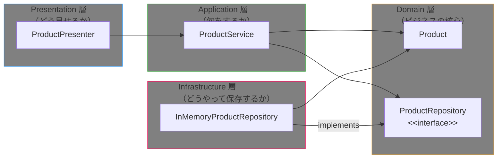
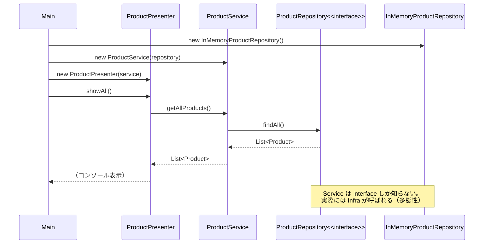
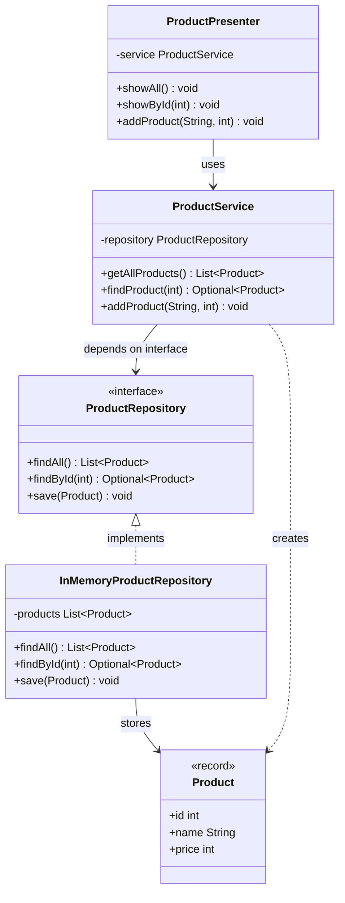

# 第14章：設計とアーキテクチャ

> この章は**最終章**だ。第01章から積み上げてきたすべての知識——クラス設計・OOP・コレクション・I/O・JDBC・並行処理・HTTPクライアント——を「どう組み合わせるか」という設計の視点で統合する。
>
> テーマは「なぜその設計にするのか」だ。他章では抽象化・設計パターンを控えめにしてきたが、この章ではそれらを積極的に扱う。

---

## この章の問い（第10〜13章から持ち越した疑問）

第10章以降で実践的なコードを書いてきたとき、次のような疑問を感じなかったか？

1. **コードが長くなるにつれて「どこに何を書けばよいか」がわからなくなってきた。整理する方法はあるのか？**
2. **DB をインメモリから JDBC に変えたいとき、どこまで修正すればよいかわからない。変更範囲を最小化する設計はあるのか？**
3. **テストを書きたいのに、`main` を実行しないと動作確認できない。テストしやすいコードの書き方はあるのか？**

**この章でこの3つの問いにすべて答える。**

---

## アーキテクチャの全体像



> **依存の向き:** 矢印はすべて Domain（中心）を向いている。Domain 層は何にも依存せず、最も安定した層だ。

---

## 学習の流れ

| ファイル | テーマ | 体験できる Why |
| --- | --- | --- |
| `BigMainAntiPattern.java` | Before: 全ロジックを1クラスに詰め込む | なぜ「大きな main」は保守できなくなるのか |
| `onion/domain/Product.java` | ドメインエンティティ（Record） | なぜバリデーションをコンストラクタに書くのか |
| `onion/domain/ProductRepository.java` | リポジトリインターフェース | なぜインターフェースを Domain 層に置くのか（DIP） |
| `onion/application/ProductService.java` | ユースケース（ビジネスロジック） | なぜ具体的な DB クラスを知らなくてよいのか |
| `onion/infrastructure/InMemoryProductRepository.java` | インフラ実装 | なぜここだけ変えれば DB 切替ができるのか |
| `onion/presentation/ProductPresenter.java` | プレゼンテーション | なぜ表示ロジックを分離するのか |
| `Main.java` | Composition Root（依存の組み立て） | なぜ具体的な実装を知るのはここだけでよいのか |

---

## 各節の説明

### 1. Before: BigMainAntiPattern — 「大きな泥団子」を体験する

「とりあえず動けばいい」で書き続けると、データ管理・ビジネスロジック・表示処理がすべて1つのクラスに混在する。これを「大きな泥団子（Big Ball of Mud）」と呼ぶ。

```java
// ★ 問題1: 商品を String[] で表現しているため型安全性がない
private static List<String[]> products = new ArrayList<>(List.of(
    new String[]{"1", "ノートPC", "80000"}  // p[0]が id か name かは読まないとわからない
));

// ★ 問題2: 検索・表示・バリデーションがすべて同じメソッドに混在
public static void run() {
    // 表示ロジック ─────────────────────────────────────────
    for (String[] p : products) { System.out.println(p[1]); }

    // 検索ロジック ─────────────────────────────────────────
    for (String[] p : products) { if (p[0].equals("2")) found = p; }

    // バリデーション + 保存 ─────────────────────────────────
    if (newName.isBlank() || newPrice <= 0) { ... }
    products.add(new String[]{...});
}
```

**このコードの問題点:**

* `String[]` に型安全性がない。`p[1]` が名前か価格かはコードを読まないと判断できない
* 表示・検索・保存が混在しているため、変更の影響範囲が広い
* `main` を実行しないと動作確認できず、自動テストが書けない
* 永続化方法（ArrayList）を DB に変えるとき、全体を修正する必要がある

---

### 2. After: Onion Architecture — レイヤー分割で解決する

同じ「商品管理」機能を4つの層に分割することで、上記の問題をすべて解決する。

#### Domain 層 — ビジネスの核心（最内層）

Domain 層はビジネスの「言葉」をコードで表現する。DBの都合も画面の都合も持ち込まない。

```java
// Product.java: Record でエンティティを表現（Java 16 以降）
public record Product(int id, String name, int price) {
    // コンパクトコンストラクタでバリデーション——「不正な商品」は絶対に作れない
    public Product {
        if (name == null || name.isBlank()) throw new IllegalArgumentException("商品名は空にできません");
        if (price <= 0) throw new IllegalArgumentException("価格は1円以上を指定してください");
    }
}
```

```java
// ProductRepository.java: インターフェースを Domain 層に置く——これが DIP の核心
public interface ProductRepository {
    List<Product> findAll();
    Optional<Product> findById(int id);
    void save(Product product);
}
```

> **なぜインターフェースを Domain 層に置くのか？**
> 「商品を保存・取得する能力が欲しい」はビジネスの要求だ。「どうやって保存するか（DB・ファイル・インメモリ）」はインフラの詳細にすぎない。インターフェースを Domain に置くことで、Infrastructure が Domain を向く依存関係が生まれる。これが依存逆転の原則（DIP）だ。

#### Application 層 — 何をするか（ユースケース）

```java
public class ProductService {
    // ★ インターフェース型で保持——具体的な DB クラスを知らない
    private final ProductRepository repository;

    // コンストラクタ注入: 依存をコンストラクタで受け取る（Spring の @Autowired も同じ仕組み）
    public ProductService(ProductRepository repository) {
        this.repository = repository;
    }

    public void addProduct(String name, int price) {
        int nextId = repository.findAll().stream().mapToInt(Product::id).max().orElse(0) + 1;
        Product product = new Product(nextId, name, price);  // バリデーションはドメインに委譲
        repository.save(product);
    }
}
```

#### Infrastructure 層 — どうやって保存するか（詳細実装）

```java
// ★ Domain 層のインターフェースを implements する——依存の矢印が内側を向く
public class InMemoryProductRepository implements ProductRepository {
    private final List<Product> products = new ArrayList<>(List.of(
        new Product(1, "ノートPC", 80000),
        new Product(2, "マウス",   3000)
    ));

    @Override
    public Optional<Product> findById(int id) {
        return products.stream().filter(p -> p.id() == id).findFirst();
    }
    // ...
}
```

> DB を切り替えたいときは `InMemoryProductRepository` を `JdbcProductRepository` に差し替えるだけ。`ProductService` は無変更。

#### Presentation 層 — どう見せるか

```java
public class ProductPresenter {
    private final ProductService service;  // Application 層にのみ依存

    public void showAll() {
        service.getAllProducts().forEach(p ->
            System.out.printf("  ID=%-3d %-12s %,d円%n", p.id(), p.name(), p.price()));
    }
    // コンソール → JSON → HTML に変えても、ProductService は無変更
}
```

#### Main.java — Composition Root（依存関係の組み立て場所）

```java
public class Main {
    public static void main(String[] args) {
        // ★ Composition Root: 具体的な実装クラスを知っているのはここだけ
        // この1行を JdbcProductRepository に変えるだけで DB 切替が完了する
        ProductRepository repository = new InMemoryProductRepository();
        ProductService service = new ProductService(repository);
        ProductPresenter presenter = new ProductPresenter(service);

        presenter.showAll();
        presenter.addProduct("キーボード", 8000);
    }
}
```

---

## 依存逆転の原則（DIP）を図で理解する





---

## まとめてコンパイル・実行する

```bash
javac -d out/ $(find src/main/java/com/example/architecture -name "*.java")
java -cp out/ com.example.architecture.Main
```

---

## 第14章のまとめ

* **大きな泥団子（Big Ball of Mud）の回避:** データ・ロジック・表示が混在すると変更コストが指数的に増える。Onion Architecture はこれを4層に分離する
* **Domain 層が核心:** 最も変化の少ない「ビジネスの概念」を最内層に置き、外部技術への依存をゼロにする
* **依存逆転の原則（DIP）:** インターフェースを Domain 層に置くことで、Infrastructure の矢印が内側を向く。DB を変えても上位層は無変更
* **依存注入（DI）:** コンストラクタで依存を受け取る設計にすると、テスト時はモック実装へ差し替えられる。Spring の `@Autowired` はこれを自動化したもの
* **Composition Root:** 具体的な実装クラスを知るのはエントリーポイント（`Main.java`）だけ。変更箇所が1か所に集まる
* **各層を独立してテスト可能:** `ProductService` に `new InMemoryProductRepository()` を渡すだけで、DB なしの単体テストが書ける

---

## 確認してみよう

1. `BigMainAntiPattern.java` の商品データを DB（H2）に変えるとしたら、何行目から何行目を修正する必要があるか考えてみよう。次に `InMemoryProductRepository` を JDBC 実装に差し替える場合と比較してみよう。

2. `ProductPresenter.java` の `showAll()` をコンソール出力ではなく JSON 文字列を返すメソッドに変えてみよう（`public String toJson()`）。`ProductService` や `Product` には変更が不要なことを確認しよう。

3. `ProductService.addProduct()` に「同じ商品名は登録できない」というビジネスルールを追加してみよう。どの層に追加するのが正しいか考えながら実装しよう。

4. `ProductRepository` インターフェースに `deleteById(int id)` を追加し、`InMemoryProductRepository` に実装して、`ProductService` に `removeProduct(int id)` メソッドを追加してみよう。

5. `Product` レコードを通常のクラスに書き直してみよう（`equals`・`hashCode`・`toString` を手動実装する）。Record がどれだけボイラープレートを削減しているかを実感しよう。

6. テスト専用の `MockProductRepository` クラスを作り（`implements ProductRepository`）、`ProductService` に渡してテストしてみよう。`main` を実行しなくても動作確認できることを確認しよう。

---

| [← 第13章: HTTPクライアントと外部API連携](../http_client/README.md) | [全章目次](../../../../../../README.md) | [第15章: クリーンアーキテクチャ →](../clean_architecture/README.md) |
| :--- | :---: | ---: |
