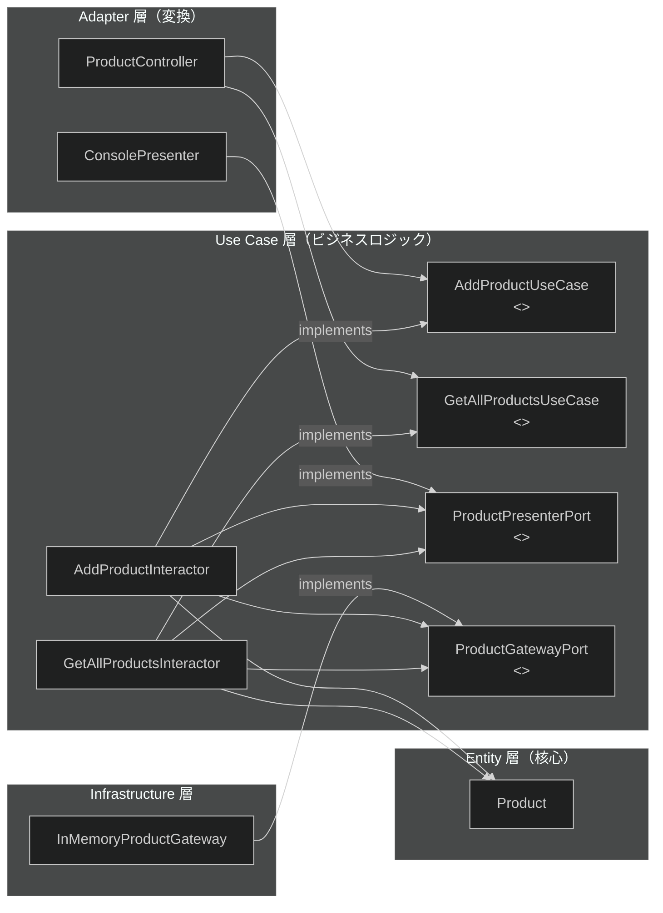
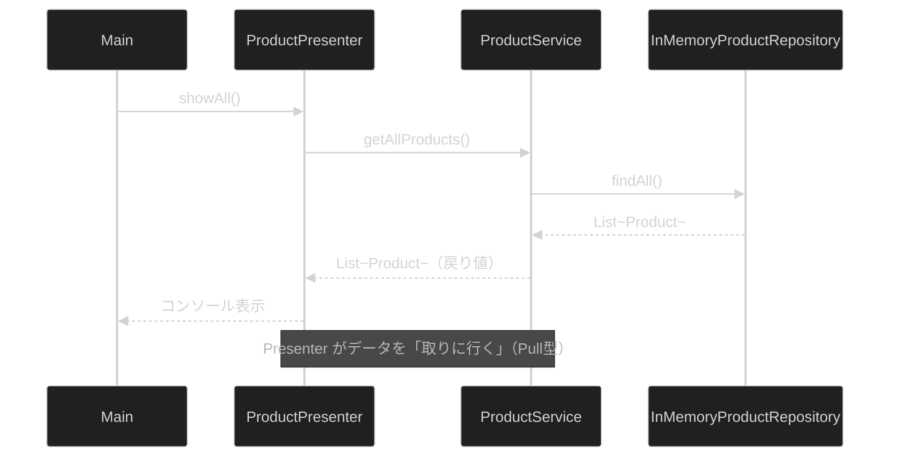
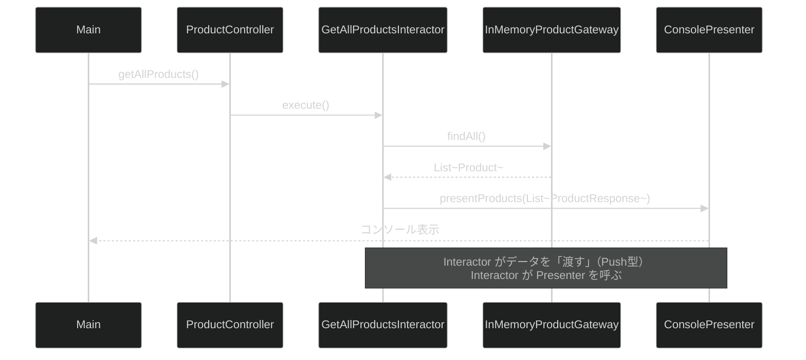

# 第16章：クリーンアーキテクチャ

> 第15章でアーキテクチャの進化史（Layered → Hexagonal → Onion → Clean）を学び、Onion Architecture を実装した。この章では同じ「商品管理」機能を **Clean Architecture** で実装し直す。同じ機能を別のアーキテクチャで書くことで、思想の違いと使い分けを体験できる。

---

## この章の問い（第15章から持ち越した疑問）

第15章で Onion Architecture を学んだとき、こんな疑問を持たなかったか？

1. **Presenter が Service を呼んでデータを受け取る設計は、Presenter が「何を取るか」を知りすぎていないか？**
2. **Use Case（ビジネスロジック）をインターフェースとして定義すると、テスト時に差し替えやすくなるのではないか？**
3. **引数が増えたとき `service.addProduct(String, int)` のシグネチャが変わると呼び出し元をすべて直す必要があるが、DTO を使えば影響を局所化できないか？**

**この章でこの3つの問いにすべて答える。**

---

## Onion Architecture（第15章）vs Clean Architecture（第16章）

| 概念 | Onion Architecture | Clean Architecture |
| --- | --- | --- |
| ビジネスロジックの単位 | `ProductService` のメソッド | `AddProductInteractor`（Use Case 1つ = クラス1つ） |
| 入力の定義 | メソッドシグネチャ `addProduct(String, int)` | Input Port（インターフェース）+ `AddProductRequest` DTO |
| 出力の方法 | 戻り値（`List<Product>` を返す）**Pull型** | Output Boundary を呼ぶ **Push型** |
| ドメインの越境 | `Product` が層間を直接流通 | `ProductResponse` DTO に変換して流通 |
| Controller の存在 | Presenter がサービスを直接呼ぶ | Controller が入力を DTO に変換してから呼ぶ |

### 最大のポイント: データの流れ方が逆になる

```java
// Onion（第15章）: Pull型——Presenter がデータを「取りに行く」
List<Product> products = service.getAllProducts();  // ← 戻り値
for (Product p : products) { System.out.println(p.name()); }

// Clean（第16章）: Push型——Interactor がデータを「渡す」
interactor.execute();  // ← 内部で presenter.presentProducts(dtos) を呼ぶ
// Presenter は「呼ばれるのを待つ」だけでよい
```

---

## アーキテクチャの全体像



> **依存のルール:** すべての矢印は内側（Entity / Use Case）を向いている。Use Case 層は何の具体的な実装クラスも知らない。

---

## 学習の流れ

| ファイル | 層 | 体験できる Why |
| --- | --- | --- |
| `clean/entity/Product.java` | Entity | 第15章と同じ Entity——アーキテクチャが変わっても Entity は変わらない |
| `clean/usecase/AddProductRequest.java` | Use Case | なぜ生の引数ではなく Request DTO を使うのか |
| `clean/usecase/ProductResponse.java` | Use Case | なぜ Entity をそのまま返さず DTO に変換するのか |
| `clean/usecase/AddProductUseCase.java` | Use Case | なぜ Use Case をインターフェース（入力ポート）にするのか |
| `clean/usecase/ProductPresenterPort.java` | Use Case | なぜ出力を「戻り値」ではなくコールバックで渡すのか（出力ポート） |
| `clean/usecase/ProductGatewayPort.java` | Use Case | Onion の ProductRepository と何が違うのか |
| `clean/usecase/AddProductInteractor.java` | Use Case | Interactor がどうやって Presenter を呼ぶのか |
| `clean/usecase/GetAllProductsInteractor.java` | Use Case | Entity を DTO に変換するのはどこの責務か |
| `clean/adapter/ProductController.java` | Adapter | Controller が「変換だけ」をする理由 |
| `clean/adapter/ConsolePresenter.java` | Adapter | 出力ポートを implements する Presenter の役割 |
| `clean/infrastructure/InMemoryProductGateway.java` | Infrastructure | `nextId()` を Gateway に委譲する設計の理由 |
| `Main.java` | Composition Root | なぜ Presenter を先に作る必要があるのか |

---

## 各クラスの説明

### Entity 層 — 最内層（どのアーキテクチャでも変わらない）

```java
// Product.java: 第15章と完全に同じ Record
public record Product(int id, String name, int price) {
    public Product {  // コンパクトコンストラクタでバリデーション
        if (name == null || name.isBlank()) throw new IllegalArgumentException("商品名は空にできません");
        if (price <= 0) throw new IllegalArgumentException("価格は1円以上を指定してください");
    }
}
```

### Use Case 層 — ビジネスロジックと境界インターフェース

**入力ポート（Input Port）:** Use Case を「インターフェース」として定義する

```java
public interface AddProductUseCase {
    void execute(AddProductRequest request);  // ← Request DTO で入力を受け取る
}
```

**出力ポート（Output Boundary）:** Interactor が結果を「Push」する相手

```java
public interface ProductPresenterPort {
    void presentProducts(List<ProductResponse> products);  // 全商品表示
    void presentAddSuccess(ProductResponse product);       // 追加成功
    void presentError(String message);                     // エラー
}
```

**Interactor（Use Case 実装）:** インターフェースにのみ依存し、結果を出力ポートに Push する

```java
public class AddProductInteractor implements AddProductUseCase {
    private final ProductGatewayPort gateway;     // データアクセス（インターフェース）
    private final ProductPresenterPort presenter; // 出力（インターフェース）

    @Override
    public void execute(AddProductRequest request) {
        try {
            int nextId = gateway.nextId();
            Product product = new Product(nextId, request.name(), request.price());
            gateway.save(product);
            // ★ 戻り値ではなく presenter に Push する（Clean Architecture の核心）
            presenter.presentAddSuccess(new ProductResponse(product.id(), product.name(), product.price()));
        } catch (IllegalArgumentException e) {
            presenter.presentError(e.getMessage());
        }
    }
}
```

### Adapter 層 — 変換の責務のみ

```java
public class ProductController {
    public void addProduct(String name, int price) {
        // 生の入力（String・int）→ Request DTO に変換してから Use Case を呼ぶ
        addProductUseCase.execute(new AddProductRequest(name, price));
    }
}

public class ConsolePresenter implements ProductPresenterPort {
    @Override
    public void presentProducts(List<ProductResponse> products) {
        // DTO の値を受け取り、書式整形して表示する（ロジックなし）
        products.forEach(p ->
            System.out.printf("  ID=%-3d %-12s %,d円%n", p.id(), p.name(), p.price()));
    }
}
```

### Main.java — Composition Root の組み立て順序

```java
// ★ Presenter を先に作る（Interactor が Presenter を必要とするため）
ProductGatewayPort gateway = new InMemoryProductGateway();
ProductPresenterPort presenter = new ConsolePresenter();

// Interactor（Use Case 実装）に gateway と presenter を注入する
AddProductUseCase addUseCase = new AddProductInteractor(gateway, presenter);
GetAllProductsUseCase getAllUseCase = new GetAllProductsInteractor(gateway, presenter);

// Controller に Use Case インターフェースを注入する
ProductController controller = new ProductController(addUseCase, getAllUseCase);
```

> **Onion との違い:** Onion では `repository → service → presenter` の順で組み立てたが、Clean では `gateway・presenter → interactor → controller` の順になる。Interactor が Presenter を「持つ」ため、先に Presenter を作る必要がある。

---

## データフローの比較

### Onion Architecture（第15章）: Pull型



### Clean Architecture（第16章）: Push型



---

## まとめてコンパイル・実行する

```bash
javac -d out/ $(find src/main/java/com/example/clean_architecture -name "*.java")
java -cp out/ com.example.clean_architecture.Main
```

---

## 第16章のまとめ

* **入力ポート（Input Port）:** Use Case をインターフェースとして定義することで、Interactor をテスト時に差し替えられる
* **出力ポート（Output Boundary）:** Interactor が Presenter を呼ぶ「Push型」にすることで、表示方法の変更が Interactor に影響しない
* **DTO による境界の明確化:** `AddProductRequest`・`ProductResponse` を使うことで、層をまたぐデータの形を明示的に定義できる
* **Controller の役割:** 生の入力を DTO に変換するだけ。ビジネスロジックを一切持たない
* **Onion との使い分け:** 小〜中規模は Onion が実装コスト低で効果的。大規模・Use Case が複雑になるほど Clean の入力/出力ポート分離が威力を発揮する
* **どちらも DIP を実践:** 依存逆転の原則（DIP）は共通。違うのは「インターフェースをどの層に置くか」と「データの流れ方（Pull vs Push）」だ

---

## 確認してみよう

1. `ConsolePresenter` を `JsonPresenter`（JSON 文字列を返す）に差し替えてみよう。`AddProductInteractor` や `GetAllProductsInteractor` は変更が不要なことを確認しよう。

2. `InMemoryProductGateway` を `SortedProductGateway`（価格順に並べて返す）に差し替えてみよう。Use Case 層・Adapter 層は何も変えなくてよいことを確認しよう。

3. `AddProductUseCase` に対してモック実装を作り、「`execute()` が1回呼ばれたか」をテストしてみよう。Interactor の内部に依存しない単体テストが書けることを確認しよう。

4. `ProductPresenterPort` に `presentNotFound(int id)` メソッドを追加して、ID 検索ユースケース（`FindProductByIdUseCase`）と対応する Interactor を実装してみよう。

5. 第15章（Onion Architecture）の `ProductService.addProduct()` と第16章（Clean Architecture）の `AddProductInteractor.execute()` を見比べて、「引数の数が5つに増えたとき」どちらが変更しやすいか考えてみよう。

6. なぜ `GetAllProductsInteractor` は `Product` エンティティをそのまま渡さず `ProductResponse` へ変換するのか。変更への耐性と Entity の純粋性という2つの視点から説明してみよう。

---

| [← 第15章: 設計とアーキテクチャ](../architecture/README.md) | [全章目次](../../../../../../README.md) | 最終章 |
| :--- | :---: | ---: |
