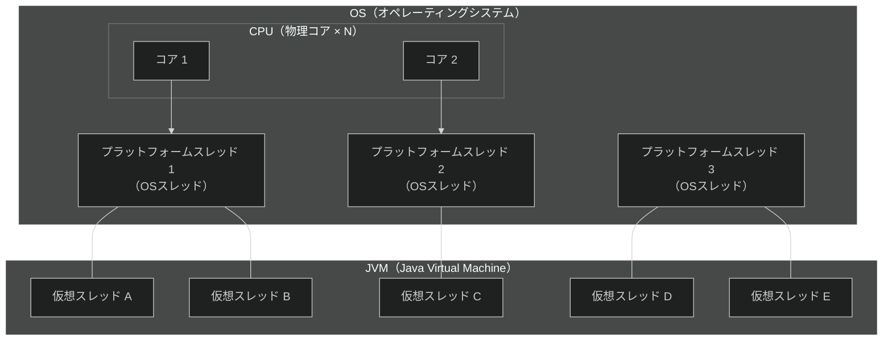
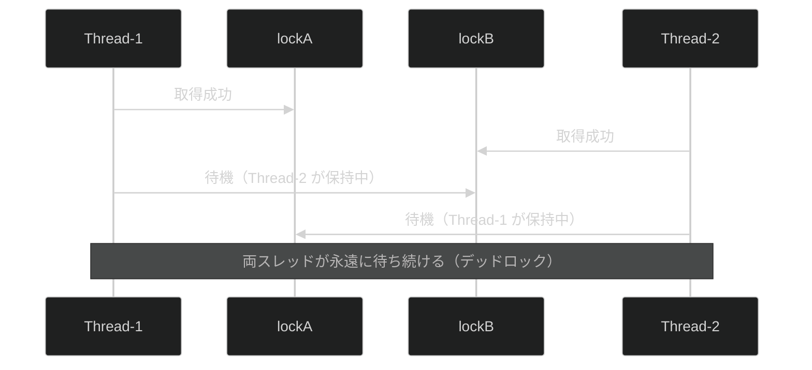
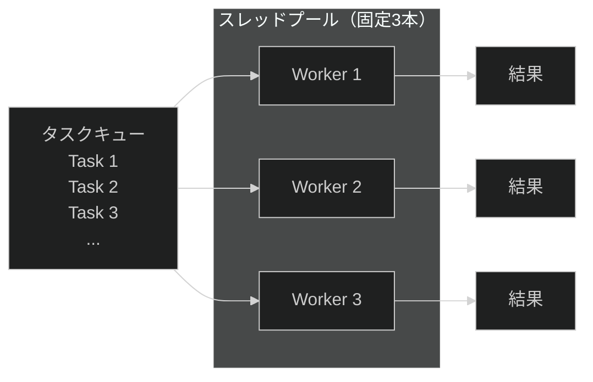

# 第12章：並行処理・非同期処理の基礎

> この章から**実践レベルの後半**に入る。第10章・第11章で学んだファイルI/OやDB接続の「待ち時間問題」を解決するための手段として、並行処理を学ぶ。
>
> **注意:** この章のサンプルコードはマルチスレッドのため、実行するたびに結果が変わることがある。これはバグではなく、スレッドの実行順序が不定であることを体験するためのサンプルだ。

---

## この章の問い（第11章から持ち越した疑問）

第11章でJDBCのDB接続を手書きしたとき、次のような疑問を持たなかったか？

1. **データベースへのアクセスは時間がかかるのに、その間プログラムは何もできないのか？**
2. **Webサーバーは複数のリクエストを同時に処理できるが、どうやってそれを実現しているのか？**
3. **Vert.x の Event Loop はどういう仕組みで動いているのか？**

**この章でこの3つの問いにすべて答える。**

---

## CPU・スレッド・仮想スレッドの関係



* **プラットフォームスレッド（従来のスレッド）:** OSスレッドと1対1で対応する。メモリを多く消費し、大量に作れない
* **仮想スレッド（Java 21）:** JVMが管理する軽量スレッド。少数のプラットフォームスレッドで大量の仮想スレッドを動かせる

---

## 学習の流れ

| ファイル | テーマ | 体験できる Why |
| --- | --- | --- |
| [`ThreadBasics.java`](ThreadBasics.java) | スレッドの基本・競合状態 | なぜ `synchronized` と `AtomicInteger` が必要なのか |
| [`DeadlockDemo.java`](DeadlockDemo.java) | デッドロックの体験と回避 | なぜロック取得順序を全スレッドで統一するのか |
| [`ExecutorServiceDemo.java`](ExecutorServiceDemo.java) | ExecutorService・Future・CompletableFuture | なぜ生スレッドではなくスレッドプールを使うのか |
| [`VirtualThreadDemo.java`](VirtualThreadDemo.java) | 仮想スレッド（Java 21） | なぜ Java 21 で I/O バウンドのサーバーが速くなるのか |

---

## 各節の説明

### 1. ThreadBasics.java — スレッドの基本と競合状態を体験する

#### 並列（Parallelism）と並行（Concurrency）の違い

マルチスレッドを理解するうえで、最初に混乱しやすいのがこの2つの概念だ。

* **並列（Parallelism）:** 複数の処理が物理的に**同時に**実行される状態だ。CPUコアが複数なければ実現できない
* **並行（Concurrency）:** 複数の処理が**交互に少しずつ**実行される状態だ。シングルコアのCPUでも、OSが高速に切り替えることで見かけ上「同時に動いている」ように見える

日常的なたとえで言えば、「並列」はコックが2人いるキッチン、「並行」は1人のコックが複数の料理を交互にかき混ぜている状態だ。

#### Thread の2つの起動方法

**旧来の方法（extends Thread）:**

```java
class MyThread extends Thread {
    @Override
    public void run() {
        System.out.println("スレッド実行: " + Thread.currentThread().getName());
    }
}
new MyThread().start();
```

**モダンな方法（Runnable ラムダ）:**

```java
// [Java 7 不可] ラムダ式は Java 8 以降
Thread thread = new Thread(() -> {
    System.out.println("スレッド実行: " + Thread.currentThread().getName());
});
thread.start();
```

> **[Java 7 との違い]** ラムダ式は Java 8 以降の機能だ。Java 7 では匿名クラスを使う。
>
> ```java
> // Java 7 での書き方（匿名クラス）
> Thread thread = new Thread(new Runnable() {
>     @Override
>     public void run() {
>         System.out.println("スレッド実行: " + Thread.currentThread().getName());
>     }
> });
> thread.start();
> ```

#### 競合状態（Race Condition）と `++` の非アトミック性

`counter++` は一見シンプルに見えるが、実際には3ステップの操作だ。

```text
1. メモリから counter の値を読み込む（LOAD）
2. 1 を加算する（ADD）
3. 結果をメモリに書き戻す（STORE）
```

複数のスレッドがこの3ステップを同時に実行すると、途中で割り込みが起きて**カウントが失われる**（競合状態）。これが「実行するたびに結果が変わる」原因だ。

#### 解決策の比較

| 方法 | スレッドセーフ | 特徴 |
| --- | --- | --- |
| `int counter++` | × | 3ステップで非アトミック。複数スレッドで壊れる |
| `synchronized` | ○ | ブロック単位でロック。シンプルだが待ちが発生する |
| `AtomicInteger` | ○ | CPU の CAS（Compare-And-Swap）命令でロックなし・高速 |

```bash
javac -d out/ src/main/java/com/example/concurrency/ThreadBasics.java
java -cp out/ com.example.concurrency.ThreadBasics
```

---

### 2. DeadlockDemo.java — デッドロックを発生させ、プログラムが永遠に止まる恐怖を体験する

デッドロックとは、**2つのスレッドがお互いに相手のロックを待ち続けて、永遠に進めなくなる状態**だ。

```text
Thread-1: lockA を取得 → lockB を待つ（ずっと待ち続ける）
Thread-2: lockB を取得 → lockA を待つ（ずっと待ち続ける）
→ どちらも前に進めない。プログラムが永遠にフリーズする
```

これはサービス停止に直結する深刻な問題だ。ログにエラーが出るわけでもなく、**ただプログラムが止まるだけ**なので、原因の特定が非常に難しい。

#### デッドロックの発生状況（シーケンス図）



#### 回避策1: `tryLock` でタイムアウト検出する

`synchronized` の代わりに `ReentrantLock.tryLock(timeout)` を使うと、一定時間内にロックを取得できなかった場合に**諦めて処理を中断できる**。プログラムが永遠に止まることを防げる。

#### 回避策2: ロック取得順序を全スレッドで統一する（最も重要）

デッドロックの根本原因は「スレッドによってロック取得順序が異なる」ことだ。

```text
Thread-1: lockA → lockB の順で取得
Thread-2: lockA → lockB の順で取得（Thread-1 と同じ順序）
→ Thread-2 は Thread-1 が lockA を解放するまで待つだけ。デッドロックは起きない
```

**全スレッドが同じ順序でロックを取得する**—これだけでデッドロックの大半は防げる。

```bash
javac -d out/ src/main/java/com/example/concurrency/DeadlockDemo.java
java -cp out/ com.example.concurrency.DeadlockDemo
```

---

### 3. ExecutorServiceDemo.java — なぜ生スレッドではなくスレッドプールを使うのか

#### 生スレッドの問題点

```java
// [アンチパターン] タスクのたびに new Thread() する
for (int i = 0; i < 1000; i++) {
    new Thread(() -> doWork()).start();  // 1000本のスレッドを一気に作る
}
```

* スレッドを毎回生成・破棄するコストが高い
* スレッド数が無制限に増えてメモリを食い尽くす危険がある
* スレッド数が多すぎるとOSのスケジューリングが追いつかず、逆に遅くなる

#### スレッドプール（ExecutorService）の構造



スレッドプールはあらかじめ決まった本数のスレッドを用意しておき、タスクをキューに積んで順番に処理させる。スレッドの生成・破棄コストがかからず、同時に動くスレッド数を制御できる。

#### Before（生スレッド）→ After（ExecutorService）

**Before（生スレッド）:**

```java
// [アンチパターン] スレッドを無制限に生成する
Thread t = new Thread(() -> System.out.println("処理完了"));
t.start();
```

**After（ExecutorService）:**

```java
// [Java 7 不可] ラムダ式は Java 8 以降
ExecutorService executor = Executors.newFixedThreadPool(3);
executor.submit(() -> System.out.println("処理完了"));
executor.shutdown();
```

> **[Java 7 との違い]** ラムダ式は Java 8 以降だ。Java 7 では `submit(new Runnable() { ... })` のように匿名クラスを使う。`ExecutorService` 自体は Java 5 以降で使える。

#### Future で結果を受け取る

`submit()` は `Future<T>` を返す。`future.get()` を呼ぶまでメインスレッドは**別の処理を並行して実行できる**。

```java
Future<Integer> future = executor.submit(() -> {
    Thread.sleep(1000);  // 時間のかかる処理（例: DBアクセス）
    return 42;
});
// future.get() を呼ぶまで、この行は即座に実行される
System.out.println("別の処理をしている...");
Integer result = future.get();  // ここで1秒待つ
```

#### CompletableFuture のチェーン処理

```java
// [Java 7 不可] CompletableFuture は Java 8 以降
CompletableFuture.supplyAsync(() -> fetchFromDB())   // 非同期でDB取得
    .thenApply(data -> transform(data))              // 結果を変換
    .thenAccept(result -> System.out.println(result)); // 最終結果を使う
```

> **[Java 7 との違い]** `CompletableFuture` は Java 8 以降だ。Java 7 では `Future` と `ExecutorService` を組み合わせて同等の処理を書く。

#### Vert.x との接続

Vert.x の `WorkerExecutor` は `ExecutorService` と同じスレッドプールの考え方で動いている。`vertx.executeBlocking()` でブロッキング処理をワーカースレッドにオフロードする仕組みは、この章で学ぶ `ExecutorService.submit()` と本質的に同じだ。

```bash
javac -d out/ src/main/java/com/example/concurrency/ExecutorServiceDemo.java
java -cp out/ com.example.concurrency.ExecutorServiceDemo
```

---

### 4. VirtualThreadDemo.java — Java 21 の仮想スレッドで I/O バウンドを攻略する

#### プラットフォームスレッド vs 仮想スレッド

| 種類 | メモリ（目安） | 最大同時起動数（目安） | 最適なケース |
| --- | --- | --- | --- |
| プラットフォームスレッド | 1〜2 MB / スレッド | 数百〜数千本 | CPU バウンド |
| 仮想スレッド（Java 21） | 数 KB / スレッド | 数万〜数百万本 | I/O バウンド |

**I/O バウンド**とは、DBアクセス・HTTP通信・ファイル読み書きのように「待ち時間が大半を占める処理」のことだ。プラットフォームスレッドはI/O待ちの間もOSのスレッドリソースを占有してしまうが、仮想スレッドはI/O待ちの間にプラットフォームスレッドを解放して別の仮想スレッドを実行できる。

#### 仮想スレッドの起動方法

```java
// [Java 7 不可 / Java 21 以降] 仮想スレッドの起動
Thread vThread = Thread.ofVirtual().start(() -> {
    System.out.println("仮想スレッド: " + Thread.currentThread());
});

// [Java 7 不可 / Java 21 以降] ExecutorService 経由で使う
ExecutorService executor = Executors.newVirtualThreadPerTaskExecutor();
executor.submit(() -> System.out.println("仮想スレッドで実行"));
executor.shutdown();
```

> **[Java 7 との違い]** 仮想スレッド（`Thread.ofVirtual()`・`Executors.newVirtualThreadPerTaskExecutor()`）は Java 21 以降の機能だ。Java 7 では通常のプラットフォームスレッドで代替する。

#### 注意点

* **ピンニング問題:** `synchronized` ブロック内でブロッキングI/Oを行うと、仮想スレッドがプラットフォームスレッドに「固定（ピン）」されてしまい、性能上のメリットが失われる。Java 21 では `ReentrantLock` を使うことで回避できる
* **CPU バウンドには不向き:** 純粋な計算処理（ソートや数値演算など）には仮想スレッドのメリットは出ない。プラットフォームスレッド + `ForkJoinPool` の方が適している

```bash
javac -d out/ src/main/java/com/example/concurrency/VirtualThreadDemo.java
java -cp out/ com.example.concurrency.VirtualThreadDemo
```

---

## まとめてコンパイル・実行する

```bash
javac -d out/ src/main/java/com/example/concurrency/*.java
java -cp out/ com.example.concurrency.ThreadBasics
java -cp out/ com.example.concurrency.DeadlockDemo
java -cp out/ com.example.concurrency.ExecutorServiceDemo
java -cp out/ com.example.concurrency.VirtualThreadDemo
```

---

## 第12章のまとめ

* **並行と並列の違い:** 並行（Concurrency）は「交互に少しずつ実行」、並列（Parallelism）は「物理的に同時実行」だ。マルチスレッドはどちらの性質も持つが、目的によって使い分ける
* **競合状態の恐ろしさ:** `counter++` のような単純な操作でもスレッドセーフではない。`synchronized` か `AtomicInteger` で保護する必要がある
* **デッドロックはプログラムが永遠に止まる:** ロック取得順序を全スレッドで統一することが最も確実な回避策だ。`tryLock` でタイムアウト検出する方法もある
* **生スレッドより ExecutorService を使う:** スレッド数の制御・生成コストの削減・タスク結果の取得（`Future`）が現場での標準的なアプローチだ。Vert.x の `WorkerExecutor` もこの仕組みで動いている
* **仮想スレッドは I/O バウンドの切り札（Java 21）:** 数万〜数百万本の軽量スレッドを起動できる。DBアクセスやHTTP通信が多いサーバーアプリケーションで特に効果を発揮する

---

## 確認してみよう

1. [`ThreadBasics.java`](ThreadBasics.java) で `unsafeCounter` をインクリメントするスレッド数を 1000 本・1回ずつに変えて実行してみよう。競合状態は発生するか？また、何度実行しても同じ結果になるか確認しよう。

2. [`DeadlockDemo.java`](DeadlockDemo.java) のロック順序統一セクションで、両スレッドが `lockA → lockB` の順に取得しているとき、なぜデッドロックが起きないか説明してみよう。「Thread-2 が lockA を待つとき Thread-1 はどういう状態にあるか」という視点で考えよう。

3. [`ExecutorServiceDemo.java`](ExecutorServiceDemo.java) で `newFixedThreadPool(3)` を `newFixedThreadPool(1)` に変えて実行してみよう。処理時間はどう変わるか？スレッド数を増やしても一定以上は速くならない理由も考えよう。

4. [`ExecutorServiceDemo.java`](ExecutorServiceDemo.java) の `Future.get()` を呼ぶ前に「メインスレッドは別の処理もできる」と説明した。具体的にどんな処理（例: ログ出力・別のDBクエリ発行など）を追加して試せるか考え、実際にコードを書いて動かしてみよう。

5. [`VirtualThreadDemo.java`](VirtualThreadDemo.java) でプラットフォームスレッドと仮想スレッドそれぞれ 1000 本を起動したとき、処理時間に差はあったか？処理がCPUバウンドのケースとI/Oバウンドのケースでは、仮想スレッドのメリットに差が出るはずだ。なぜ差が出る（または出ない）のかを説明してみよう。

---

| [← 第11章: データベースアクセス（JDBC）](../database_jdbc/README.md) | [全章目次](../../../../../../README.md) | [第13章: HTTPクライアントと外部API連携 →](../http_client/README.md) |
| :--- | :---: | ---: |
