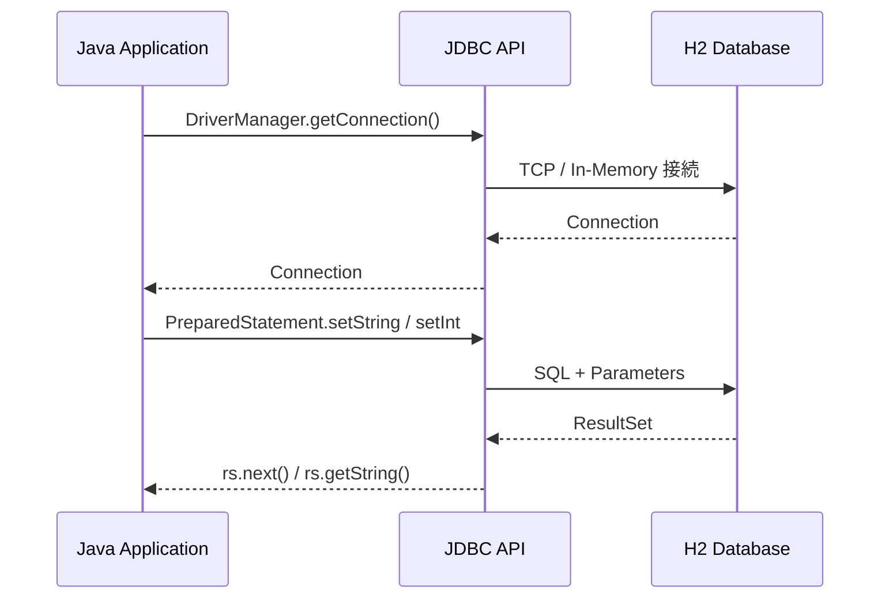

# 第11章：データベースアクセス（JDBC）

> この章は**実践レベル**だ。第10章まで終えた方を対象としている。

---

## この章の問い（第10章から持ち越した疑問）

第10章でHTTPサーバーを手書きしたとき、次のような疑問を持たなかったか？

1. **アプリケーションのデータを永続化したい—ファイルの読み書きよりも確実な方法はないか？**
2. **Spring Data JPA や MyBatis の内部ではどんな仕組みでDBにアクセスしているのか？**
3. **ユーザー入力をそのままSQLに埋め込むと何が起きるのか？**

**この章でこの3つの問いにすべて答える。**

---

## JDBC の全体像



---

## 学習の流れ

| ファイル | テーマ | 体験できる Why |
| --- | --- | --- |
| `ConnectionBasics.java` | JDBC 接続・CRUD | フレームワークが隠している接続・SQL実行の仕組みを手書きで体験する |
| `SqlInjectionDemo.java` | SQLインジェクション | なぜ PreparedStatement でなければならないのかを攻撃成立で体験する |
| `TransactionDemo.java` | トランザクション | なぜ auto-commit のままだとお金が消えるのかを実測で体験する |

---

## 各節の説明

### 1. ConnectionBasics.java — JDBC の基本 CRUD

JDBC API の最小構成を手書きして、ORM フレームワークが隠している仕組みを体験する。

#### 接続の仕組み

```java
// JDBC 4.0（Java 6+）以降、ドライバは自動登録される
// Class.forName("org.h2.Driver") は不要（Java 7 以前は必要だった）
try (Connection conn = DriverManager.getConnection(
        "jdbc:h2:mem:testdb;DB_CLOSE_DELAY=-1", "sa", "")) {
    // Connection は try-with-resources で必ずクローズする
}
```

#### PreparedStatement で CRUD を実装する

```java
// INSERT
String sql = "INSERT INTO products (name, price, category) VALUES (?, ?, ?)";
try (PreparedStatement pstmt = conn.prepareStatement(sql)) {
    pstmt.setString(1, "ノートPC");
    pstmt.setInt(2, 150_000);
    pstmt.setString(3, "PC");
    pstmt.executeUpdate();   // DML（INSERT/UPDATE/DELETE）は executeUpdate()
}

// SELECT
String selectSql = "SELECT id, name, price FROM products ORDER BY id";
try (PreparedStatement pstmt = conn.prepareStatement(selectSql);
     ResultSet rs = pstmt.executeQuery()) {  // DQL（SELECT）は executeQuery()
    while (rs.next()) {
        System.out.println(rs.getInt("id") + ": " + rs.getString("name"));
    }
}
```

#### 実行結果（目安）

```text
=== 3件の商品を INSERT しました ===
--- 商品一覧 ---
ID    名前                     価格(円) カテゴリ
--------------------------------------------------
1     ノートPC               150000 PC
2     マウス                   3500 周辺機器
3     キーボード                 8000 周辺機器

=== UPDATE 完了: 1件更新 (id=1 の価格を 145,000 に変更) ===
=== DELETE 完了: 1件削除 (id=3 キーボードを削除) ===
--- 最終の商品一覧 ---
1     ノートPC               145000 PC
2     マウス                   3500 周辺機器
```

```bash
javac -d out/ -cp lib/h2.jar src/main/java/com/example/database_jdbc/ConnectionBasics.java
java -cp "out/:lib/h2.jar" com.example.database_jdbc.ConnectionBasics
```

---

### 2. SqlInjectionDemo.java — SQL インジェクションを体験する

**[アンチパターン]** ユーザー入力を文字列連結でSQLに埋め込む `Statement` は、攻撃者に任意のSQLを実行させる脆弱性を持つ。

#### 攻撃が成立する仕組み

```sql
-- 攻撃者が username に  ' OR 1=1 --  を入力すると...
SELECT * FROM users WHERE username = '' OR 1=1 --' AND password = '...'
-- ↑ --以降がコメントになり、WHERE が常に真になる → 全ユーザーが取得される
```

#### PreparedStatement で防ぐ仕組み

```java
// ? プレースホルダーでパラメータをSQL構造と分離する
String sql = "SELECT * FROM users WHERE username = ? AND password = ?";
try (PreparedStatement pstmt = conn.prepareStatement(sql)) {
    pstmt.setString(1, "' OR 1=1 --");  // 攻撃文字列もただの文字列値として扱われる
    pstmt.setString(2, "anything");
    // → WHERE username = ''' OR 1=1 --' AND password = 'anything'（エスケープ済み）
    // → 一致するユーザーは存在しないのでログイン失敗
}
```

#### 実行結果（目安）：SqlInjectionDemo

```text
--- ② SQLインジェクション攻撃 ---
[脆弱] 実行SQL: ... WHERE username = '' OR 1=1 --' AND password = '...'
[脆弱] ログイン成功: username=alice, role=user  ← 全ユーザーが取得される！
  → 取得レコード: alice
  → 取得レコード: bob
  → 取得レコード: admin

--- ④ SQLインジェクション試み（PreparedStatement）---
[安全] ログイン失敗（インジェクション文字列はそのまま検索値として扱われる）
```

```bash
javac -d out/ -cp lib/h2.jar src/main/java/com/example/database_jdbc/SqlInjectionDemo.java
java -cp "out/:lib/h2.jar" com.example.database_jdbc.SqlInjectionDemo
```

> **[Java 7 との違い]** `Statement` / `PreparedStatement` / `DriverManager` は Java 1.1 以降の機能だ。`try-with-resources` は Java 7 以降のため `Connection` の自動クローズが使える。

---

### 3. TransactionDemo.java — トランザクションで整合性を守る

**[アンチパターン]** デフォルトの `auto-commit=true` のまま複数テーブルを更新すると、途中でエラーが起きたときにデータの整合性が崩れる。

#### 問題: auto-commit の罠

```java
// auto-commit=true（デフォルト）のとき
// Step1: Alice から引く → 即コミット（DB に確定）
// Step2: サーバー障害 → 例外発生
// Step3: Bob に足す → 実行されない
// 結果: Alice の残高だけ減り、Bob には届かない（お金が消えた）
```

#### 解決: 明示的トランザクション

```java
conn.setAutoCommit(false);  // トランザクション開始
try {
    // Step1, Step2, Step3 をすべて実行
    conn.commit();   // 全成功 → 確定
} catch (SQLException e) {
    conn.rollback(); // 途中失敗 → 全てなかったことにする
}
```

| 操作 | 意味 |
| --- | --- |
| `conn.setAutoCommit(false)` | トランザクション開始（1SQL自動コミットを止める） |
| `conn.commit()` | 全ステップ成功 → DBに確定する |
| `conn.rollback()` | 途中失敗 → 開始時点に巻き戻す |

#### 実行結果（目安）：TransactionDemo

```text
=== auto-commit 後の状態（お金が消えた！）===
--- 口座残高 ---
  Alice: 70,000 円    ← 引かれた
  Bob:   50,000 円    ← 届いていない！

=== トランザクション送金後の状態 ===
--- 口座残高 ---
  Alice: 70,000 円
  Bob:   80,000 円    ← 整合性が保たれている

=== ロールバック後の状態（変化なし）===
--- 口座残高 ---
  Alice: 70,000 円    ← 変化なし
  Bob:   80,000 円    ← 変化なし
```

```bash
javac -d out/ -cp lib/h2.jar src/main/java/com/example/database_jdbc/TransactionDemo.java
java -cp "out/:lib/h2.jar" com.example.database_jdbc.TransactionDemo
```

---

## まとめて実行する

```bash
# 全ファイルをまとめてコンパイルする
javac -d out/ -cp lib/h2.jar src/main/java/com/example/database_jdbc/*.java

# 各ファイルを順番に実行する
java -cp "out/:lib/h2.jar" com.example.database_jdbc.ConnectionBasics
java -cp "out/:lib/h2.jar" com.example.database_jdbc.SqlInjectionDemo
java -cp "out/:lib/h2.jar" com.example.database_jdbc.TransactionDemo
```

---

## 第11章のまとめ

* **JDBC の仕組み:** `DriverManager.getConnection()` → `PreparedStatement` → `executeUpdate()/executeQuery()` → `ResultSet` の順に処理する。ORM（JPA・MyBatis 等）はこの流れを自動化したツールだ。
* **PreparedStatement の必須性:** SQL インジェクション（OWASP Top 10 の常連）は `Statement` の文字列連結で発生する。`PreparedStatement` の `?` プレースホルダーは SQL 構造とパラメータを分離するため、インジェクションを原理的に防げる。
* **トランザクション:** JDBC のデフォルトは `auto-commit=true`（1SQL1コミット）。複数 SQL を一体として扱う場合は `setAutoCommit(false)` → `commit()` / `rollback()` で明示的に制御する。
* **リソース管理:** `Connection` / `PreparedStatement` / `ResultSet` はすべて `try-with-resources` でクローズする。クローズ漏れはコネクションプールの枯渇やメモリリークの原因になる。

---

## 確認してみよう

1. `ConnectionBasics.java` に `SELECT WHERE price >= ?` で価格フィルタを追加してみよう。
   5,000 円以上の商品だけを取得する SQL を PreparedStatement で実装しよう。

2. `SqlInjectionDemo.java` の `vulnerableLogin()` に別の攻撃パターン `'; DROP TABLE users; --` を試してみよう。
   テーブルが削除されるか確認して、なぜ H2 の `Statement` がこれを許すのかを説明しよう。

3. `TransactionDemo.java` の `transferWithTransaction()` で、送金後の残高チェックを「Bob の残高が上限（200,000 円）を超えたらロールバック」に変えてみよう。

4. `ConnectionBasics.java` の `Connection` を try-with-resources の外でクローズするように書き直してみよう（finally を使う）。
   try-with-resources の方が何行少ないか比較しよう。

5. `TransactionDemo.java` で `conn.setAutoCommit(false)` を削除したとき、送金の結果はどう変わるか？
   実行して確認しよう。

---

| [← 第10章: I/OとWebの基礎](../io_and_network/README.md) | [全章目次](../../../../../../README.md) | [第12章: 並行処理・非同期処理の基礎 →](../concurrency/README.md) |
| :--- | :---: | ---: |
