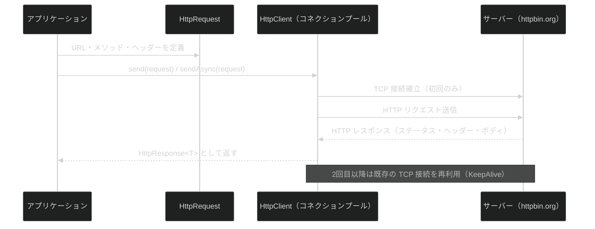
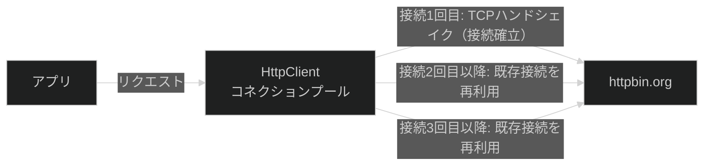
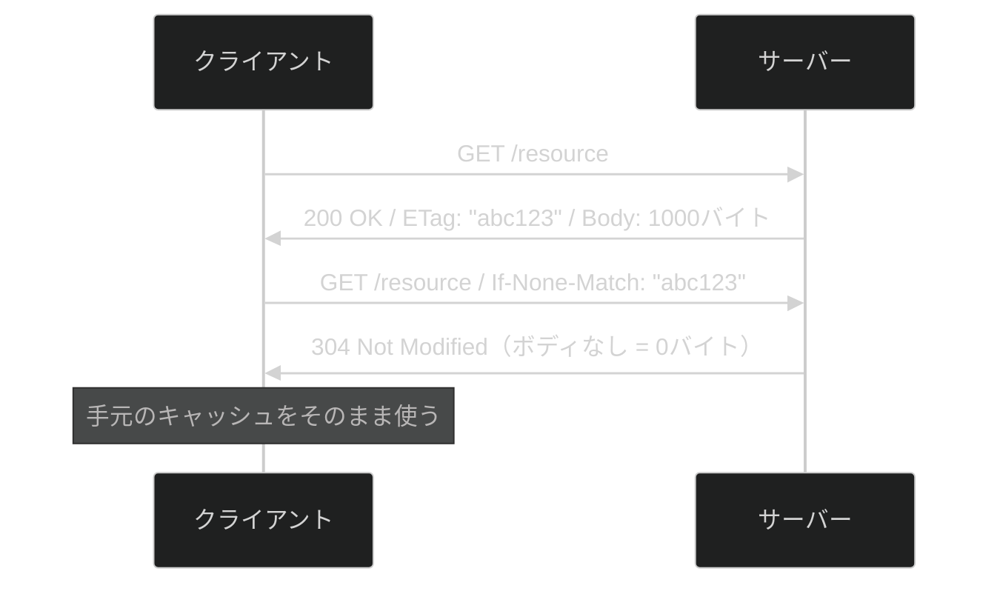

# 第13章：HTTPクライアントと外部API連携

> この章から**実践レベルの最終章**に入る。第10〜12章で学んだI/O・JDBC・並行処理の知識を組み合わせ、外部 Web API への HTTP リクエストを標準ライブラリだけで実現する方法を体験する。
>
> **【注意】** 実習用 API として `https://httpbin.org`（テスト専用の公開 API）を使用する。本番 API のエンドポイントと間違えて実行しないこと。httpbin.org はリクエスト内容をそのまま JSON で返してくれる学習専用のサービスだ。

---

## この章の問い（第12章から持ち越した疑問）

第12章で `CompletableFuture` を使った非同期処理を学んだとき、次のような疑問を持たなかったか？

1. **`CompletableFuture` で非同期にできるのはわかったが、外部 API に HTTP リクエストを送るにはどうすればよいのか？**
2. **毎回 API を叩くと遅くなるが、結果を何らかの方法でキャッシュできないのか？**
3. **Vert.x の WebClient はどういう仕組みで動いているのか？**

**この章でこの3つの問いにすべて答える。**

---

## HTTP 通信の全体像



---

## 学習の流れ

| ファイル | テーマ | 体験できる Why |
| --- | --- | --- |
| `HttpClientBasics.java` | GET/POST・同期/非同期・タイムアウト | なぜ HttpClient・HttpRequest・HttpResponse の3クラスに分かれているのか |
| `ConnectionPoolDemo.java` | コネクションプール・KeepAlive・HTTP/2 | なぜ毎回 new HttpClient() するのはアンチパターンなのか |
| `CacheStrategyDemo.java` | Cache-Control・ETag・304 Not Modified | なぜ ETag と If-None-Match でボディ転送を省けるのか |

---

## HTTP 仕様クイックリファレンス

HTTP 自体がこの章で初めて登場するため、現場で必ず知っておくべき仕様をまとめた。

### HTTP メソッドと冪等性

「冪等（べきとう）」とは、同じ操作を何度繰り返しても結果が変わらない性質だ。ネットワーク障害でレスポンスが届かなかったとき、**冪等なメソッドは安全にリトライできる**。POST をリトライすると同じデータが二重登録されうるため、設計時に意識しておきたい。

| メソッド | 用途 | 冪等 | 安全（読み取り専用） |
| --- | --- | :---: | :---: |
| `GET` | リソースの取得 | ○ | ○ |
| `HEAD` | GET と同じだがボディなし（ヘッダーだけ確認したい場合） | ○ | ○ |
| `OPTIONS` | 利用できるメソッドを確認（CORS プリフライトで使われる） | ○ | ○ |
| `POST` | リソースの新規作成 | ✗ | ✗ |
| `PUT` | リソースの全体更新（上書き） | ○ | ✗ |
| `PATCH` | リソースの部分更新 | ✗ | ✗ |
| `DELETE` | リソースの削除 | ○ | ✗ |

> **設計の判断基準:** 「更新は PUT か PATCH か」は冪等性で選ぶ。全フィールドを送れるなら PUT（冪等）、一部フィールドだけ変更するなら PATCH を使うことが多い。

### HTTP ステータスコード

現場で頻出するコードを中心に整理した。

| コード | 名前 | 意味と使われ方 |
| --- | --- | --- |
| **1xx 情報** | | |
| 100 | Continue | ボディを送り始めてよい（大きなファイル送信前の確認） |
| 101 | Switching Protocols | HTTP → WebSocket へのアップグレードで登場 |
| **2xx 成功** | | |
| 200 | OK | 最も基本的な成功。GET・PUT のレスポンスに使う |
| 201 | Created | リソース作成成功。POST 後に返すのが REST の慣習 |
| 204 | No Content | 成功したがボディなし。DELETE 後によく使う |
| **3xx リダイレクト** | | |
| 301 | Moved Permanently | URL が永久に移動（検索エンジンも新 URL を記録） |
| 302 | Found | 一時的なリダイレクト。ログイン後の画面遷移など |
| 304 | Not Modified | ETag が一致しキャッシュが有効。ボディなしで帯域を節約 |
| **4xx クライアントエラー** | | |
| 400 | Bad Request | リクエスト形式が不正（JSON の構文エラーなど） |
| 401 | Unauthorized | 認証が必要（「未認証」の意味。名前は紛らわしい） |
| 403 | Forbidden | 認証済みだが権限なし（「認可」の失敗） |
| 404 | Not Found | リソースが存在しない |
| 409 | Conflict | 状態が競合（同名ユーザーの重複登録など） |
| 415 | Unsupported Media Type | Content-Type が未対応（JSON 必須なのに text/plain など） |
| 429 | Too Many Requests | レートリミット超過。Retry-After ヘッダーで待ち時間を示す |
| **5xx サーバーエラー** | | |
| 500 | Internal Server Error | サーバーの予期しないエラー（バグや例外） |
| 502 | Bad Gateway | 上位サーバー（プロキシ等）からの不正レスポンス |
| 503 | Service Unavailable | 過負荷・メンテナンス中。一時的な障害 |
| 504 | Gateway Timeout | 上位サーバーがタイムアウト（カスケード障害の兆候） |

> **間違えやすいポイント:** 401（Unauthorized）は「未認証（誰ですか？）」、403（Forbidden）は「認証済みだが権限なし（あなたには見せられません）」。名前と意味がずれているので要注意。

---

## 各節の説明

### 1. HttpClientBasics.java — 3クラスの役割と同期/非同期の使い分け

#### 3クラスの役割

`java.net.http` パッケージには3つの主要クラスがある。なぜ1つのクラスにまとめないのか——それは**関心事の分離**のためだ。接続管理・リクエスト定義・レスポンス受信は、それぞれ独立した責務を持つ。

| クラス | 役割 | 対応する Vert.x の概念 |
| --- | --- | --- |
| `HttpClient` | 接続管理・コネクションプール・プロトコル設定 | `WebClient.create(vertx)` |
| `HttpRequest` | リクエストの定義（URL・メソッド・ヘッダー・ボディ） | `WebClient.get(port, host, path)` |
| `HttpResponse<T>` | ステータスコード・ヘッダー・ボディを持つ | `HttpResponse` |

```java
HttpClient client = HttpClient.newBuilder()
        .connectTimeout(Duration.ofSeconds(10))
        .version(HttpClient.Version.HTTP_2)
        .build();
```

#### 同期 vs 非同期

| メソッド | 動作 | 用途 |
| --- | --- | --- |
| `client.send()` | 結果が返るまでスレッドをブロック | バッチ処理・シンプルなスクリプト |
| `client.sendAsync()` | すぐに `CompletableFuture` を返す | 高スループットサーバー・複数 API 並行呼び出し |

```java
// 同期: 結果が出るまでここで待つ
HttpResponse<String> response = client.send(request, HttpResponse.BodyHandlers.ofString());

// 非同期: すぐに返る。thenApply() でレスポンスを受け取る
CompletableFuture<HttpResponse<String>> future = client.sendAsync(request, HttpResponse.BodyHandlers.ofString());
```

#### タイムアウトの2段階構成

タイムアウトには「接続確立まで」と「リクエスト全体の待ち時間」の2種類がある。この2段階を別々に設定することで、ネットワーク障害とサーバー処理遅延を区別して制御できる。

```text
HttpClient.newBuilder()
  .connectTimeout(5秒)  ← TCP接続確立（ハンドシェイク）の上限
                          ハンドシェイク = 通信前の「つながっていいですか？」という合図の交換手続き

HttpRequest.newBuilder()
  .timeout(10秒)  ← リクエスト全体（接続後のレスポンス待ち含む）の上限
```

#### MIME タイプ（メディアタイプ）

`content-type` / `accept` ヘッダーに書く「データ形式の識別子」を **MIME タイプ（メディアタイプ）** と呼ぶ。形式は `タイプ/サブタイプ` で構成される。

```text
content-type: application/json   ← 「このボディは JSON です」と伝える（送信側）
accept:       application/json   ← 「JSON で返してください」と伝える（受信側）
```

よく使う MIME タイプ一覧:

| MIME タイプ | 用途 |
| --- | --- |
| `application/json` | REST API の標準。JSON 形式のデータ |
| `text/html` | HTML ドキュメント |
| `text/plain` | プレーンテキスト |
| `application/xml` | XML 形式のデータ |
| `application/octet-stream` | 汎用バイナリ（ファイルダウンロード等） |
| `multipart/form-data` | ファイルアップロード付きフォーム送信 |
| `image/png`・`image/jpeg` | 画像ファイル |

> **ポイント:** `content-type` を省略すると、サーバーが形式を判断できず `415 Unsupported Media Type` エラーになることがある。REST API を呼ぶときは必ず明示的に指定する。

```bash
javac -d out/ src/main/java/com/example/http_client/HttpClientBasics.java
java -cp out/ com.example.http_client.HttpClientBasics
```

> **[Java 7 との違い]** `java.net.http.HttpClient` は Java 11 以降の機能だ。Java 7/8 では `HttpURLConnection`（標準）または Apache HttpClient・OkHttp（外部ライブラリ）を使う必要がある。
>
> ```java
> // Java 7 での書き方（HttpURLConnection）
> HttpURLConnection con = (HttpURLConnection) new URL("https://httpbin.org/get").openConnection();
> con.setRequestMethod("GET");
> con.setConnectTimeout(10000);
> int status = con.getResponseCode();
> ```

---

### 2. ConnectionPoolDemo.java — コネクションプールと KeepAlive を計測する

#### アンチパターン: 毎回 new HttpClient() を呼ぶ

```java
// [アンチパターン] ループ内で毎回 new HttpClient() を呼ぶ
for (int i = 0; i < 100; i++) {
    HttpClient client = HttpClient.newHttpClient(); // ← 毎回 TCP 接続を新規確立
    client.send(request, HttpResponse.BodyHandlers.ofString());
}
```

このコードの問題は3点ある。

* 毎回 TCP ハンドシェイク（接続確立の手続き）のコストが発生する。ハンドシェイクとは、コンピュータ同士がデータのやり取りを始める前に、人間が握手をして「こんにちは、よろしくお願いします」と挨拶し合うような仕組みである。このとき、通信してよいか判定も済ませる。クライアントとサーバーの間では接続確立の合図として TCP で3回のメッセージ往復（SYN → SYN-ACK → ACK/NACK）が必要だ。HTTPS ではさらに TLS ハンドシェイク（証明書の検証と暗号鍵の交換）も加わる
* スレッドプールも毎回作られ、GC 対象になる（リソースの無駄遣い）
* HTTP/2 の多重化の恩恵を一切受けられない

#### コネクションプールの仕組み



`HttpClient` を1回だけ作ってフィールドやシングルトンに保持すると、内部のコネクションプールが同じホストへの接続を自動的に再利用する。Vert.x の `WebClient.create(vertx)` も「1回だけ作る」のが正しい使い方だ。

#### HTTP バージョンの違い

| バージョン | 多重化 | KeepAlive | 特徴 |
| --- | --- | --- | --- |
| HTTP/1.1 | × | ○ | 1接続で1リクエスト。次のリクエストは前が終わるまで待つ |
| HTTP/2 | ○ | ○ | 1接続で複数リクエストを同時に送受信（ストリーム多重化） |

`HttpClient.Version.HTTP_2` を設定すると、サーバーが対応していれば HTTP/2 を使い、非対応なら HTTP/1.1 に自動フォールバックする。

```bash
javac -d out/ src/main/java/com/example/http_client/ConnectionPoolDemo.java
java -cp out/ com.example.http_client.ConnectionPoolDemo
```

---

### 3. CacheStrategyDemo.java — ETag と Cache-Control でリクエストを削減する

#### Cache-Control ディレクティブ

| ディレクティブ | 意味 | 典型的な用途 |
| --- | --- | --- |
| `max-age=N` | N秒間はキャッシュを使ってよい（再リクエスト不要） | 静的ファイル・変更頻度の低いマスターデータ |
| `no-cache` | キャッシュ可だが毎回サーバーに検証を求める | ETag と組み合わせて帯域節約 |
| `no-store` | キャッシュ禁止 | 認証情報・個人情報・決済情報 |
| `public` | 中継プロキシでもキャッシュ可 | CDN で配信する静的コンテンツ |
| `private` | ブラウザのみキャッシュ可 | ユーザー固有のレスポンス |

#### ETag の仕組み

ETag（Entity Tag）とは「このリソースのバージョン識別子」だ。ファイルのハッシュ値や更新日時をもとにサーバーが生成する。クライアントは次のリクエスト時に `If-None-Match` ヘッダーで ETag を送り返す。サーバーは「内容が変わっていない」と判断したとき、ボディを送らずに `304 Not Modified` だけを返す。



```bash
javac -d out/ src/main/java/com/example/http_client/CacheStrategyDemo.java
java -cp out/ com.example.http_client.CacheStrategyDemo
```

---

## まとめてコンパイル・実行する

```bash
javac -d out/ src/main/java/com/example/http_client/*.java
java -cp out/ com.example.http_client.HttpClientBasics
java -cp out/ com.example.http_client.ConnectionPoolDemo
java -cp out/ com.example.http_client.CacheStrategyDemo
```

---

## 第13章のまとめ

* **HttpClient は1回だけ作って使い回す:** 内部でコネクションプールを管理している。毎回 `new HttpClient()` はリソースの無駄遣いだ
* **同期と非同期を使い分ける:** `send()` はシンプルだが待ち時間に CPU を使えない。`sendAsync()` + `CompletableFuture` で高スループットを実現する
* **HTTP/2 で多重化:** 1つの接続で複数リクエストを並列に送受信できる。`HttpClient.Version.HTTP_2` を設定するだけで自動的に活用される
* **キャッシュで API コールを削減:** `Cache-Control: max-age` で一定時間キャッシュを使い、ETag + `If-None-Match` でボディ転送を省く。サーバー負荷・帯域・レイテンシの三拍子を同時に削減できる
* **Vert.x の WebClient との接続:** `WebClient.create(vertx)` は1回だけ作る、リアクティブ（非同期）ファーストの設計になっている。この章で学んだ概念（コネクション再利用・非同期処理・キャッシュヘッダー）はそのまま適用できる

---

## 確認してみよう

1. `HttpClientBasics.java` の同期 GET と非同期 GET で、それぞれ `System.nanoTime()` で処理時間を計測して比較してみよう。同じリクエストなのに結果に差は出るか？

2. `ConnectionPoolDemo.java` で `REQUEST_COUNT` を 10 や 20 に増やして実行してみよう。Before（毎回 new）と After（再利用）の差はどう変化するか？

3. `HttpClientBasics.java` の POST セクションで、JSON ボディを `{"name": "あなたの名前", "chapter": 13}` に変えて実行してみよう。httpbin.org のレスポンスのどのフィールドに送ったデータが含まれているか確認しよう。

4. `CacheStrategyDemo.java` の section3 で `If-None-Match` に指定する ETag を意図的に間違った値にすると、レスポンスはどう変わるか？実行して確認しよう。

5. `HttpClientBasics.java` の section2（同期 GET）のタイムアウトを 1 ミリ秒（`Duration.ofMillis(1)`）に設定して実行してみよう。`HttpTimeoutException` は発生するか？どのようなエラーメッセージが出るか？

---

| [← 第12章: 並行処理・非同期処理の基礎](../concurrency/README.md) | [全章目次](../../../../../../README.md) | [第14章: 安全なコーディング →](../safe_coding/README.md) |
| :--- | :---: | ---: |
