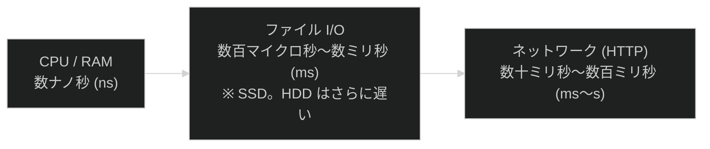

# 第10章：I/O と Web の基礎

> この章は**実践レベル**です。第09章まで終えた方を対象としている。

---

## この章の問い（第09章から持ち越した疑問）

第09章を終えたとき、次のような疑問を持ちませんでしたか？

1. **`System.nanoTime()` で計測したが、ファイルの読み書きはなぜプログラムのコードより圧倒的に遅いのか？**
2. **テキストファイルをJavaで読み書きするにはどうすればよいか？**
3. **HTTP リクエストを送る処理はソートのような同期的な処理と何が違うのか？**

**この章でこの3つの問いにすべて答える。**

---

## ファイルI/OとHTTPの速度の地図

処理レイヤーが外に出るほど、アクセスにかかる時間は桁違いに増える。



| レイヤー | 代表的なアクセス時間 | 備考 |
| --- | --- | --- |
| CPU / RAM | 1 〜 100 ns | キャッシュヒット時は 1 ns 以下 |
| ファイル I/O (SSD) | 100 μs 〜 数 ms | OS のディスクキャッシュが効くと速くなる |
| ネットワーク (HTTP) | 数十 ms 〜 数百 ms | レイテンシは物理的な距離に依存する |

---

## 学習の流れ

| ファイル | テーマ | 体験できる Why |
| --- | --- | --- |
| [`FileReadWrite.java`](FileReadWrite.java) | ファイルの読み書き | なぜ BufferedReader/Writer より Files.readString() が現場で好まれるのか |
| [`CsvHandler.java`](CsvHandler.java) | CSV の読み書き | なぜ split(",") だけでは実運用に耐えないのか |
| [`HttpServerBasics.java`](HttpServerBasics.java) | HTTP サーバー（Before） | フレームワークが隠している仕組みを体験する |
| [`HttpServerRefactored.java`](HttpServerRefactored.java) | HTTP サーバー（After） | なぜ Handler / Service に分けると保守しやすいのか |
| [`PropertiesConfig.java`](PropertiesConfig.java) | 設定ファイル（.properties） | なぜ設定をコードに書くと変更のたびに再コンパイルが必要になるのか |
| [`XmlProcessing.java`](XmlProcessing.java) | XML 生成・解析・スキーマ検証 | なぜ CSV より XML が「構造の強制」に向いているのか |
| [`LoggingBasics.java`](LoggingBasics.java) | java.util.logging | なぜ System.out.println() はログの代わりにならないのか |

---

## 各節の説明

### 1. FileReadWrite.java — ファイルI/Oの基礎を学ぶ

**Before（BufferedReader / BufferedWriter — Java 7+）:**

```java
try (BufferedWriter writer = new BufferedWriter(new FileWriter("file.txt", StandardCharsets.UTF_8))) {
    writer.write("Hello");
    writer.newLine();
}
try (BufferedReader reader = new BufferedReader(new FileReader("file.txt", StandardCharsets.UTF_8))) {
    String line;
    while ((line = reader.readLine()) != null) {
        System.out.println(line);
    }
}
```

**After（Files.writeString() / readString() — Java 11+）:**

```java
// [Java 7 不可] Files.writeString() / readString() は Java 11 以降
Files.writeString(Path.of("file.txt"), "Hello\n", StandardCharsets.UTF_8);
String content = Files.readString(Path.of("file.txt"), StandardCharsets.UTF_8);
```

| API | 導入バージョン | 特徴 |
| --- | --- | --- |
| `BufferedReader` / `BufferedWriter` | Java 1.1 | バッファリングで I/O 効率化。細かい制御ができる |
| `Files.readAllLines()` | Java 7 | 全行を一括で `List<String>` として取得する |
| `Files.readString()` / `writeString()` | Java 11 | 最も簡潔。小〜中規模ファイルに最適だ |

**計測結果（目安）:**

```text
メモリ操作  ×100回: 約   19 ms
ファイルI/O ×100回: 約  140 ms
→ ファイルI/O はメモリ操作の約 7 倍遅い（OS ディスクキャッシュ込みでも差が出る）
```

```bash
javac -d out/ src/main/java/com/example/io_and_network/FileReadWrite.java
java -cp out/ com.example.io_and_network.FileReadWrite
```

> **[Java 7 との違い]** `Files.writeString()` / `readString()` は Java 11 以降、`Files.readAllLines()` は Java 8 以降、`Path.of()` は Java 11 以降の機能だ。Java 7 では `BufferedReader` / `BufferedWriter` を使う。

---

### 2. CsvHandler.java — CSV の読み書きと RFC 4180

**[アンチパターン]** 単純な `split(",")` は、値の中にカンマが含まれると正しく動作しない。

```java
// [アンチパターン] カンマを含む値が壊れる
String line = "\"マウス, ワイヤレス\",3500,周辺機器";
String[] cols = line.split(",");
// → cols[0]="\"マウス", cols[1]=" ワイヤレス\"" ... 4要素になってしまう
```

**RFC 4180 のクォートルール:**

* 値にカンマ・改行・ダブルクォートが含まれる場合は `"..."` で囲む
* クォート内のダブルクォートは `""` にエスケープする

**JSON / XML の補足:** CSVの次にAPIやバッチ処理でよく登場するのがJSONとXMLだ。

* JSON: `com.fasterxml.jackson.databind.ObjectMapper`（Jackson）や Gson が現場の標準ライブラリだ
* XML: `javax.xml.parsers.DocumentBuilder`（Java標準）で DOM として読める

```bash
javac -d out/ src/main/java/com/example/io_and_network/CsvHandler.java
java -cp out/ com.example.io_and_network.CsvHandler
```

---

### 3. HttpServerBasics.java — HTTP サーバーをスクラッチで作る（Before）

> **【注意】** `com.sun.net.httpserver.HttpServer` は学習用の内部APIだ。このAPIは本番コードでは使わないこと。フレームワーク（Spring Boot 等）の内部がどう動いているかを体験するための学習用APIである。

`com.sun.net.httpserver.HttpServer` で3つのエンドポイントを実装する。

| エンドポイント | レスポンス |
| --- | --- |
| `GET /` | "Hello, World!" |
| `GET /time` | "現在時刻: yyyy/MM/dd HH:mm:ss" |
| `GET /echo?msg=...` | "Echo: ..." |

**[アンチパターン]** すべてのロジックを `main` に詰め込んだ状態を体験する。ルート追加のたびに `main` が肥大化し、テストできず、再利用もできない。

```bash
javac -d out/ src/main/java/com/example/io_and_network/HttpServerBasics.java
java -cp out/ com.example.io_and_network.HttpServerBasics
# → http://localhost:8080 にアクセスできる（5秒後に自動終了）
```

---

### 5. PropertiesConfig.java — 設定をコードから分離する

**Before（ハードコード）:**

```java
// [アンチパターン] 接続先・ポート・タイムアウトをコードに直書きする
String host      = "localhost";
int    port      = 5432;
int    timeoutMs = 3000;
// → 本番環境に合わせて変えるたびに再コンパイルが必要
```

**After（.properties ファイルから読み込む）:**

```java
Properties props = new Properties();
// [Java 7 不可] new FileReader(path, charset) は Java 11 以降
try (FileReader reader = new FileReader("app.properties", StandardCharsets.UTF_8)) {
    props.load(reader);  // key=value を一括読み込み
}
String host    = props.getProperty("db.host");
int    port    = Integer.parseInt(props.getProperty("db.port", "5432")); // デフォルト値付き
String missing = props.getProperty("db.password", "(未設定)");           // キーがなければデフォルト値
```

| メソッド | 説明 |
| --- | --- |
| `load(Reader)` | .properties ファイルを読み込む |
| `getProperty(key)` | 値を取得する（なければ null） |
| `getProperty(key, default)` | デフォルト値付き取得 |
| `setProperty(key, value)` | 値をセットする |
| `store(Writer, comment)` | ファイルに書き出す |

> **[現場での管理]** 開発者が `app.properties.example`（ダミー値入り）をリポジトリで管理し、本番チームや CI/CD が実際の値を記入した `app.properties` を作成する。機密情報が含まれるため `.gitignore` に追加する。

```bash
javac -d out/ src/main/java/com/example/io_and_network/PropertiesConfig.java
java -cp out/ com.example.io_and_network.PropertiesConfig
```

---

### 6. XmlProcessing.java — XML の生成・解析・スキーマ検証

**XML 生成（DocumentBuilder → Document → Transformer）:**

```java
// Step1: DocumentBuilder で空のDocumentを作成する
DocumentBuilderFactory factory = DocumentBuilderFactory.newInstance();
Document document = factory.newDocumentBuilder().newDocument();

// Step2: 要素ツリーを構築する
Element root = document.createElement("products");
document.appendChild(root);
Element product = document.createElement("product");
product.setAttribute("id", "1");                        // 属性を設定する
product.appendChild(document.createElement("name"));   // 子要素を追加する
root.appendChild(product);

// Step3: Transformer でファイルに書き出す（OutputKeys.INDENTで整形）
Transformer transformer = TransformerFactory.newInstance().newTransformer();
transformer.setOutputProperty(OutputKeys.INDENT, "yes");
transformer.transform(new DOMSource(document), new StreamResult(new File("products.xml")));
```

**XML 解析（DOM: parse → NodeList → テキスト取得）:**

```java
Document doc = factory.newDocumentBuilder().parse(new File("products.xml"));
NodeList products = doc.getElementsByTagName("product");
for (int i = 0; i < products.getLength(); i++) {
    Element p = (Element) products.item(i);
    String id    = p.getAttribute("id");                                   // 属性を取得する
    String name  = p.getElementsByTagName("name").item(0).getTextContent(); // 子要素のテキストを取得する
}
```

**スキーマ検証（XSD）:**

```java
// SchemaFactory で XSD ファイルを読み込んで Validator を作成する
SchemaFactory sf = SchemaFactory.newInstance(XMLConstants.W3C_XML_SCHEMA_NS_URI);
Schema schema = sf.newSchema(new File("products.xsd"));
Validator validator = schema.newValidator();
validator.validate(new StreamSource(new File("products.xml"))); // 違反があれば SAXException
```

| 方式 | 特徴 | 向いている場面 |
| --- | --- | --- |
| DOM | 全体をメモリに読み込む。扱いやすい | 小〜中規模のXML |
| SAX | イベント駆動型。メモリ効率が高い | 大規模なXML（数百MB〜） |
| StAX | プル型でSAXより書きやすい | 大規模XMLを逐次処理 |

```bash
javac -d out/ src/main/java/com/example/io_and_network/XmlProcessing.java
java -cp out/ com.example.io_and_network.XmlProcessing
```

---

### 7. LoggingBasics.java — java.util.logging でログを体系化する

**Before（System.out.println のアンチパターン）:**

```java
// [アンチパターン] レベル制御もファイル出力も不可能
System.out.println("[情報] 商品を追加しました: ノートPC");
System.out.println("[デバッグ] 在庫チェック: 在庫=10");
// → 本番でデバッグ行を消すには、コードを修正して再コンパイルが必要
```

**After（java.util.logging）:**

```java
Logger logger = Logger.getLogger(LoggingBasics.class.getName());
logger.setUseParentHandlers(false); // ルートロガーへの二重出力を防ぐ

ConsoleHandler ch = new ConsoleHandler();
ch.setLevel(Level.INFO);            // コンソールには INFO 以上のみ表示する

FileHandler fh = new FileHandler("app.log");
fh.setLevel(Level.ALL);             // ファイルにはすべてのレベルを記録する
fh.setFormatter(new SimpleFormatter());

logger.addHandler(ch);
logger.addHandler(fh);
logger.setLevel(Level.ALL);

logger.info("商品を追加しました: ノートPC");   // 本番で表示（INFO）
logger.fine("在庫チェック実行: 在庫=10");       // 本番では非表示（FINE）
logger.warning("在庫不足: 要求=15, 在庫=10"); // 本番で表示（WARNING）
logger.severe("バグ: 在庫数が負の値です");      // 本番で表示（SEVERE）
```

| レベル | 用途 | 本番での可視性 |
| --- | --- | --- |
| `SEVERE` | アプリを止めるエラー | 常に表示 |
| `WARNING` | 回復可能な問題 | 常に表示 |
| `INFO` | 通常の業務イベント | 表示（現場標準） |
| `CONFIG` | 設定値の出力 | 任意 |
| `FINE` | デバッグ詳細 | 非表示（開発のみ） |
| `FINER` / `FINEST` | 詳細トレース | 非表示 |

> **[logging.properties]** `java -Djava.util.logging.config.file=logging.properties` を使うとコードを変えずにログレベルを変更できる。[`PropertiesConfig.java`](PropertiesConfig.java) の「設定の外出し」と同じ考え方だ。

```bash
javac -d out/ src/main/java/com/example/io_and_network/LoggingBasics.java
java -cp out/ com.example.io_and_network.LoggingBasics
```

---

### 4. HttpServerRefactored.java — Handler / Service / Helper への分割（After）

同じ3つのエンドポイントを、責務ごとにクラスを分割してリファクタリングする。

```text
HttpServerRefactored
├── HelloHandler   → GET / のレスポンスを担当
├── TimeHandler    → GET /time のレスポンスを担当
├── EchoHandler    → GET /echo のレスポンスを担当
├── TimeService    → 現在時刻のビジネスロジック
├── QueryParser    → クエリ文字列のパース
└── ResponseHelper → 共通のレスポンス送信処理
```

**第04章・第06章との接続:** インターフェースによるポリモーフィズム（第06章）と「責務の分離」（第04章）が、Webサーバーの設計にも同じように適用される。

```bash
javac -d out/ src/main/java/com/example/io_and_network/HttpServerRefactored.java
java -cp out/ com.example.io_and_network.HttpServerRefactored
# → http://localhost:8080 にアクセスできる（5秒後に自動終了）
```

> **[Java 7 との違い]** `java.time`（LocalDateTime 等）は Java 8 以降の機能だ。`com.sun.net.httpserver.HttpServer` は Java 6 以降で利用できるが、ラムダ式による Handler 登録は Java 8 以降だ。

---

## まとめて実行する

```bash
# 全ファイルをまとめてコンパイルする
javac -d out/ $(find src/main/java/com/example/io_and_network -name "*.java")

# 各ファイルを順番に実行する
java -cp out/ com.example.io_and_network.FileReadWrite
java -cp out/ com.example.io_and_network.CsvHandler
java -cp out/ com.example.io_and_network.PropertiesConfig
java -cp out/ com.example.io_and_network.XmlProcessing
java -cp out/ com.example.io_and_network.LoggingBasics
java -cp out/ com.example.io_and_network.HttpServerBasics
java -cp out/ com.example.io_and_network.HttpServerRefactored
```

---

## 第10章のまとめ

* **ファイルI/Oの遅さ:** CPUやRAMに比べてディスクI/Oは何桁も遅い。`BufferedReader`/`Writer` のバッファリングや `Files.readString()` の一括読み込みで最小限のシステムコール回数にするのが基本だ。
* **CSV の落とし穴:** `split(",")` は「カンマを含む値」に対応できない。RFC 4180 のクォートルールを守ることが現場では必須だ。JSON / XML も外部ライブラリ（Jackson 等）を使うのが現場標準だ。
* **設定の外出し:** `java.util.Properties` を使うことで、コードを再コンパイルせずに接続先やタイムアウト値を変更できる。開発・本番で設定が異なる場合に必須の技法だ。
* **XML の生成・解析・検証:** JAXP（標準ライブラリ）だけで XML を生成（`DocumentBuilder`）・解析（`NodeList`）・スキーマ検証（`Validator`）できる。CSVと違い、「構造の強制」こそXMLの強みだ。
* **ログの体系化:** `System.out.println()` はログではない。`java.util.logging` はレベルによるフィルタリング・ファイルへの自動書き込み・タイムスタンプ付与を標準ライブラリだけで実現する。
* **HTTP サーバーの仕組み:** リクエストを受け取り、ルーティングして、レスポンスを返す—これがすべてのWebフレームワークの核心だ。`com.sun.net.httpserver` でその仕組みをゼロから体験した。
* **責務の分離:** Handler（リクエスト処理）/ Service（ビジネスロジック）/ Helper（共通処理）に分けることで、ルート追加がクラス追加だけで済むようになる。これは第04章・第06章で学んだ「インターフェースと責務分離」の実践だ。

---

## 確認してみよう

1. [`FileReadWrite.java`](FileReadWrite.java) の計測セクションで、データ量を 10,000 行に増やして実行してみましょう。
   ファイルI/O の時間はどう変化しますか？メモリ操作との比率はどう変わりましたか？

2. [`CsvHandler.java`](CsvHandler.java) で、名前に改行文字（`\n`）を含む商品を追加して書き込んでみましょう。
   RFC 4180 のクォート処理で正しく扱えるか確認しましょう。

3. [`HttpServerBasics.java`](HttpServerBasics.java) に `GET /hello?name=...` エンドポイントを追加してみましょう。
   main がさらに長くなることを確認して、リファクタリングが必要な理由を実感しましょう。

4. [`HttpServerRefactored.java`](HttpServerRefactored.java) に新しいエンドポイント `GET /greet?name=...` を追加してみましょう。
   新しい Handler クラスを1つ追加するだけで済むことを確認しましょう。

5. [`HttpServerBasics.java`](HttpServerBasics.java) の各ハンドラーをユニットテストしようとしたとき、何が問題になりますか？
   [`HttpServerRefactored.java`](HttpServerRefactored.java) の `TimeService` はなぜテストしやすいか、理由を説明しましょう。

6. [`PropertiesConfig.java`](PropertiesConfig.java) で、存在しないキーを `getProperty(key)` で取得するとどうなるか確認しよう。
   `getProperty(key, defaultValue)` との違いを説明してみよう。

7. [`XmlProcessing.java`](XmlProcessing.java) で、XSD に `minOccurs="1"` で定義された `<name>` 要素を削除した不正なXMLを作り、スキーマ検証してみよう。どんなエラーメッセージが出るか確認しよう。

8. [`LoggingBasics.java`](LoggingBasics.java) の ConsoleHandler のレベルを `Level.FINE` に変更して実行してみよう。どのログ行が追加で表示されるか確認しよう。本番でいつ有用かも考えてみよう。

---

| [← 第09章: アルゴリズムとソート](../algorithms/README.md) | [全章目次](../../../../../../README.md) | [第11章: データベースアクセス →](../database_jdbc/README.md) |
| :--- | :---: | ---: |
