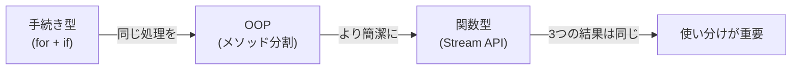

# 第08章：モダン API と堅牢なコーディング

> この章は**基礎応用レベル**です。第07章まで終えた方を対象としています。

---

## この章の問い（第07章から持ち越した疑問）

第07章を終えたとき、次のような疑問を持ちませんでしたか？

1. **コレクションを「for 文でループして条件分岐」するコードをもっと短く書く方法はないか？**
2. **`null` を返すメソッドがあると呼び出し元で必ず `if (x != null)` チェックが必要になる—もっと安全に表現する方法は？**
3. **`SimpleDateFormat` はなぜ現場で嫌われるのか？`DateTimeFormatter` との違いは何か？**

**この章でこの3つの問いにすべて答えます。**

---

## プログラミングパラダイムの地図（第06章の復習）

第06章で学んだ「3つのパラダイム」を、今章ではコードとして体験する。



---

## 学習の流れ

| # | ファイル | テーマ | 体験できる Why |
| --- | --- | --- | --- |
| 1 | `StreamAPI.java` | Stream API | 同じ処理を3通りで書いて「パラダイムの使い分け」を体験する |
| 2 | `OptionalBasics.java` | Optional | `null` を型で表現して「ヌルポ」を防ぐ |
| 3 | `DateTimeApi.java` | java.time | `SimpleDateFormat` の問題を `DateTimeFormatter` で解決する |
| 4 | `ExceptionHandling.java` | 例外処理 | 空の catch が最も危険なアンチパターンである理由を体験する |
| 5 | `ImmutableDesign.java` | イミュータブル設計 | 第04章の Dog クラスに setter がなかった理由への答え |

---

## 各節の説明

### 1. StreamAPI.java — 3通りの書き方で学ぶ Stream API

「年収500万円以上のエンジニア部門の社員名一覧を取得する」という同じ処理を3通りで実装し、結果が一致することを確認する。

| 実装方法 | 書き方 | 特徴 |
| --- | --- | --- |
| 手続き型 | `for` ループ + `if` 文 | デバッグしやすい。初学者に読みやすい |
| OOP | 処理をメソッドに切り出す | ロジックを再利用・テストしやすい |
| 関数型 | `stream().filter().map().toList()` | 宣言的で読みやすい。慣れが必要 |

「どれが正解か」ではなく「状況で使い分ける」—現場のコードは3つが混在するのが現実だ。

**Stream の代表メソッドも体験する:**

```java
// [Java 7 不可] Stream API は Java 8 以降

// 年収合計を求める（reduce）
int total = employees.stream()
    .mapToInt(Employee::getSalary)
    .sum();

// ユニークな部門一覧（distinct + sorted）
List<String> departments = employees.stream()
    .map(Employee::getDepartment)
    .distinct()
    .sorted()
    .toList();

// 条件に合う件数（count）
long count = employees.stream()
    .filter(e -> e.getSalary() >= 500)
    .count();
```

```bash
javac -d out/ src/main/java/com/example/modern_api/StreamAPI.java
java -cp out/ com.example.modern_api.StreamAPI
```

> **[Java 7 との違い]** Stream API・ラムダ式・メソッド参照はすべて Java 8 以降の機能です。`toList()` は Java 16 以降（Java 8〜15 では `collect(Collectors.toList())` を使います）。`List.of()` は Java 9 以降です。
> Java 7 では拡張 `for` ループで代替します。

---

### 2. OptionalBasics.java — null を型で表現する

**Before（null を返すメソッドの問題）:**

`null` を返すメソッドは呼び出し元に null チェックを強制する。チェックを忘れると本番で `NullPointerException` が発生する—第07章 `LruCache.java` で残した問題への答えがここにある。

**After（Optional で「値がない」を型として表現）:**

```java
// [Java 7 不可] Optional は Java 8 以降

Optional<String> user = repo.findById(1);  // 存在する場合
Optional<String> missing = repo.findById(99); // 存在しない場合

user.orElse("デフォルト")                        // 値がなければデフォルト値を返す
user.orElseGet(() -> "生成されたデフォルト")       // 値がなければサプライヤーで生成
user.orElseThrow(() -> new IllegalArgumentException("ID が存在しません"))
user.ifPresent(name -> System.out.println(name)) // 値がある場合のみ処理
user.map(String::toUpperCase)                    // 値がある場合のみ変換
```

```bash
javac -d out/ src/main/java/com/example/modern_api/OptionalBasics.java
java -cp out/ com.example.modern_api.OptionalBasics
```

> **[Java 7 との違い]** `Optional<T>` は Java 8 以降の機能です。Java 7 では `null` チェックで代替します。

---

### 3. DateTimeApi.java — java.time で日時を安全に扱う

**Before（`Date` / `Calendar` / `SimpleDateFormat` の問題）:**

* `Date` の `toString()` は読みにくい形式を出力する
* `Calendar` は翌月を求めるだけで5行必要
* `SimpleDateFormat` はスレッドアンセーフ—複数スレッドで共有すると日時の計算が壊れる（第12章で体験）

**After（`java.time` の直感的な API）:**

```java
// [Java 7 不可] java.time パッケージは Java 8 以降

LocalDate today = LocalDate.now();
LocalDate deadline = LocalDate.of(2025, 12, 31);
long daysLeft = ChronoUnit.DAYS.between(today, deadline);

LocalDateTime now = LocalDateTime.now();
String formatted = now.format(DateTimeFormatter.ofPattern("yyyy/MM/dd HH:mm:ss"));

ZonedDateTime tokyo = ZonedDateTime.now(ZoneId.of("Asia/Tokyo"));
ZonedDateTime utc = tokyo.withZoneSameInstant(ZoneId.of("UTC"));
```

| クラス | 用途 |
| --- | --- |
| `LocalDate` | 日付のみ（タイムゾーンなし） |
| `LocalDateTime` | 日付 + 時刻（タイムゾーンなし） |
| `ZonedDateTime` | 日付 + 時刻 + タイムゾーン（システム間連携に使う） |
| `Period` | 日付の差分（年・月・日単位） |
| `Duration` | 時間の差分（時・分・秒単位） |

```bash
javac -d out/ src/main/java/com/example/modern_api/DateTimeApi.java
java -cp out/ com.example.modern_api.DateTimeApi
```

> **[Java 7 との違い]** `java.time` パッケージはすべて Java 8 以降の機能です。Java 7 では `java.util.Date` / `Calendar` / `SimpleDateFormat` で代替します。

---

### 4. ExceptionHandling.java — 堅牢な例外処理を学ぶ

**[アンチパターン]** 空の `catch` ブロックは最も危険なパターンだ。エラーが起きても完全に沈黙し、バグがどこで発生したか永遠にわからなくなる。

```java
// アンチパターン: 絶対に書いてはいけない
try {
    int result = Integer.parseInt("abc");
} catch (NumberFormatException e) {
    // ← 何もしない！ログすら残らない。
}
```

**この章で体験する5つのトピック:**

| トピック | 内容 |
| --- | --- |
| チェック例外 vs 非チェック例外 | `Exception` と `RuntimeException` の違い、コンパイラ強制の有無 |
| 自作例外クラス | `RuntimeException` を継承した `InsufficientStockException` |
| `finally` | 例外の有無にかかわらず必ず実行される（リソース解放に使う） |
| `try-with-resources` | `AutoCloseable` なリソースを自動クローズする（Java 7+） |
| マルチキャッチ | 複数の例外を `\|` で同時に捕捉する（Java 7+） |

```java
// 現場の判断基準:
// 「呼び出し元が回復可能な異常」→ チェック例外（Exception を継承）
// 「プログラマのミス（バグ）」 → 非チェック例外（RuntimeException を継承）
```

```bash
javac -d out/ src/main/java/com/example/modern_api/ExceptionHandling.java
java -cp out/ com.example.modern_api.ExceptionHandling
```

---

### 5. ImmutableDesign.java — 第04章の伏線回収と Records

**【第04章の伏線回収】** 第04章の `Dog` クラスになぜ `setAge()` がなかったのか—この問いへの答えがここにある。

**Before → Middle → After の3段階:**

```java
// Before: setter を持つ mutable な JavaBeans スタイル
class UserBean {
    private String name;
    private int age;
    public void setAge(int age) { this.age = age; } // 不正な値も通ってしまう
}
UserBean user = new UserBean("田中", 25);
user.setAge(-1); // 年齢がマイナスになっても通ってしまう!

// Middle: 手動イミュータブル（private final + コンストラクタのみ）
class UserImmutable {
    private final String name;
    private final int age;
    // setter は定義しない → 外部から変更不可能
}

// After: Records（Java 16 以降）
// [Java 7 不可] record キーワードは Java 16 以降。Java 7 では Middle の形で代替する。
record UserRecord(String name, int age) {
    UserRecord { // コンパクトコンストラクタでバリデーション
        if (age < 0) throw new IllegalArgumentException("...");
    }
}
```

`record` は `private final` フィールド・コンストラクタ・getter・`toString()`・`equals()`・`hashCode()` を自動生成する。

**【第12章への橋渡し】** setter を削除することで、複数のスレッドが同じオブジェクトを同時に読んでも状態が壊れない（スレッドセーフ）。詳しくは第12章「並行処理・非同期処理の基礎」で体験する。

```bash
javac -d out/ src/main/java/com/example/modern_api/ImmutableDesign.java
java -cp out/ com.example.modern_api.ImmutableDesign
```

> **[Java 7 との違い]** `record` キーワードは Java 16 以降の機能です。Java 7 では `private final` フィールド + コンストラクタ + getter のみのクラス（Middle の形）で代替します。

---

## まとめて実行する

```bash
# 全ファイルをまとめてコンパイルする
javac -d out/ src/main/java/com/example/modern_api/*.java

# 各ファイルを順番に実行する
java -cp out/ com.example.modern_api.StreamAPI
java -cp out/ com.example.modern_api.OptionalBasics
java -cp out/ com.example.modern_api.DateTimeApi
java -cp out/ com.example.modern_api.ExceptionHandling
java -cp out/ com.example.modern_api.ImmutableDesign
```

---

## 第08章のまとめ

この章で答えた3つの問い:

1. **Stream API**: `stream().filter().map().toList()` で宣言的に書ける。手続き型・OOP・関数型の3通りは状況で使い分ける—正解はない。

2. **Optional**: `null` を返す代わりに `Optional<T>` を返すことで「値がない」を型として表現できる。`orElse` / `orElseThrow` / `map` / `ifPresent` で安全に値を取り出す。

3. **java.time**: `SimpleDateFormat` はスレッドアンセーフで `Calendar` は冗長。`LocalDate` / `LocalDateTime` / `ZonedDateTime` は不変オブジェクトでスレッドセーフ、かつ直感的な API を提供する。

---

## 確認してみよう

1. `StreamAPI.java` の Step3（Stream API）を Step1（手続き型の `for` ループ）に書き直してみましょう。
   コードの行数がどれだけ増えるか確認して、Stream API が登場した動機を実感しましょう。

2. `OptionalBasics.java` の `repo.findById(99)` で `orElseThrow()` を使った場合、どの例外が投げられますか？
   `try-catch` で捕捉して、エラーメッセージを表示してみましょう。

3. `DateTimeApi.java` に「自分の誕生日から今日まで何日経過したか」を計算して表示するコードを追加してみましょう。
   `LocalDate.of()` と `ChronoUnit.DAYS.between()` を使う。

4. `ExceptionHandling.java` のアンチパターン（空の `catch`）に `System.err.println(e.getMessage())` を追加してみましょう。
   出力がどう変わるか確認して、ログを残すことの重要性を実感しましょう。

5. `ImmutableDesign.java` の `UserBean` に `setAge(-1)` を呼んだとき、`UserImmutable` の同じ操作と何が違いますか？
   両者の挙動の違いを「いつエラーが分かるか」という観点で説明しましょう。

6. `record` が自動生成する `toString()` の出力形式を確認しましょう。
   `UserImmutable` に手動で `toString()` を追加して同じ形式を再現してみましょう。

---

## 次章（第09章）への問いかけ

第08章を終えて、次のような疑問を持ちましたか？

* Stream API の `filter().map()` の内部では、どんな処理が行われているのか？
* `ArrayList` の `sort()` はどんな仕組みで動いているのか？なぜ速いのか？
* 100万件のデータから特定の値を探すとき、`contains()` より速い方法はないか？

**これらの答えは第09章「アルゴリズムとソート」で学びます。**

---

| [← 第07章: データ構造を使いこなす](../collections_deep/README.md) | [全章目次](../../../../../../README.md) | 第09章: アルゴリズムとソート（準備中） |
| :--- | :---: | ---: |
